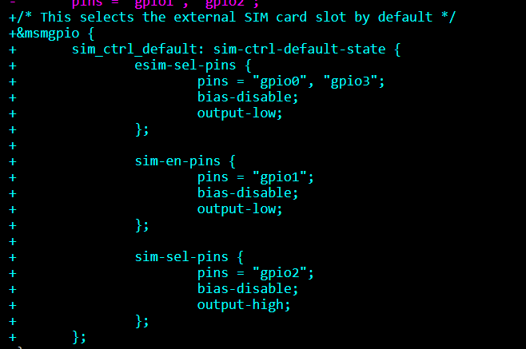

OpenStick 为 410 Wi-Fi 板适配的 Linux 内核可以在 UFI003_MB_V02 主板上启动，但 modem 工作不正常。插入 SIM 卡后，使用 `mmcli -m 0` 查看 modem 状态时，会发现 `sim-missing` 异常：

<!--more-->

## 现象

OpenStick 为 410 Wi-Fi 板适配的 Linux 内核可以在 UFI003_MB_V02 主板上启动，但 modem 工作不正常。插入 SIM 卡后，使用 `mmcli -m 0` 查看 modem 状态时，会发现 `sim-missing` 异常：

```
Status   |             state: failed
         |     failed reason: sim-missing
         |    signal quality: 0% (cached)
```
这个问题不是只有我一个人遇到，在 OpenStick 项目的 Issue 中也被提到：

[https://github.com/OpenStick/OpenStick/issues/33#issuecomment-1430420841](https://github.com/OpenStick/OpenStick/issues/33#issuecomment-1430420841)

[https://github.com/OpenStick/OpenStick/issues/20#issuecomment-1235861433](https://github.com/OpenStick/OpenStick/issues/20#issuecomment-1235861433)

## 修复

这个问题是 DTB 设备树错误配置引入的，这个 patch 修复了这个问题：

[[PATCH] arm64: dts: qcom: msm8916-ufi: Fix sim card selection pinctrl - Yang Xiwen (kernel.org)](https://lore.kernel.org/all/tencent_7036BCA256055D05F8C49D86DF7F0E2D1A05@qq.com/)

这个 patch 默认将 `sim-sel-pins` 设置为 `high`，于是内核会默认启动外置 SIM 卡。



这个 patch 已经合并进主线内核，可以选择社区维护的高通 410 内核分叉（也叫 MSM8916），源码地址：

[https://github.com/msm8916-mainline/linux](https://github.com/msm8916-mainline/linux)

这个内核树同样也支持 Qualcomm MSM8909/MSM8939 相关平台。

所以要做的就是重新编译一份包含该 patch 的主线内核。
