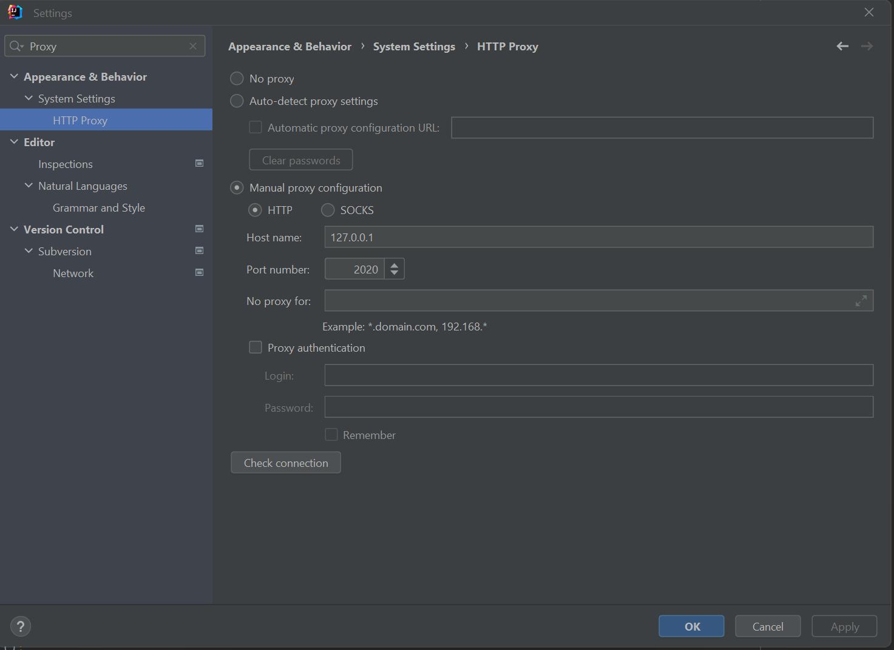
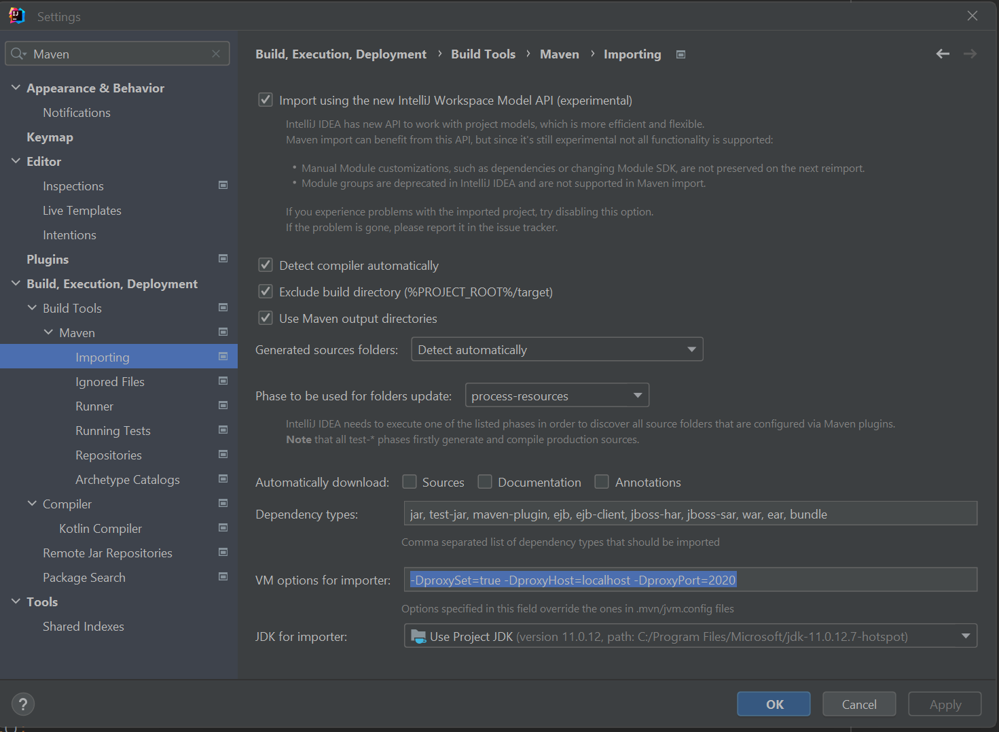

真是烦死了，每次看 Maven 的 Java 项目都要经历 jar 包下载失败；手动执行 `mvn dependency:sources`，又依赖下载失败，浪费巨多时间。

<!--more-->

## IDEA 上代理

IDEA 支持 HTTP 代理，位置是 `File | Settings | Appearance & Behavior | System Settings | HTTP Proxy`：



不得不说 IntelliJ IDEA 的 UI 逻辑做得真舒服，就好用。很难想象这种程度的 UI 竟然是使用老掉牙的 Java Swing 图形框架实现的。

## IDEA 自带的 Maven 走代理

Maven 需要额外设置，因为 IDEA 和 Maven 启动的 JVM 虚拟机是两个独立的 JVM 进程。



在 `File | Settings | Build, Execution, Deployment | Build Tools | Maven | Importing` 的 `VM options for importer` 内填写 JVM 的启动参数，让 Maven 所在的 JVM 全局走代理就行：

```bash
-DproxySet=true -DproxyHost=localhost -DproxyPort=2020
```

最后：IDE 我只选 IntelliJ IDEA，虽然当然我最常用的是 VSCode。

祝大家新年快乐呀~
