functions echo 的 scanf 没有对输入的buffer 大小做限制而用户可以输入超长字符串覆盖函数的 return 地址，进而跳转执行 secretFunction 函数。

<!--more-->

考虑下面的代码：

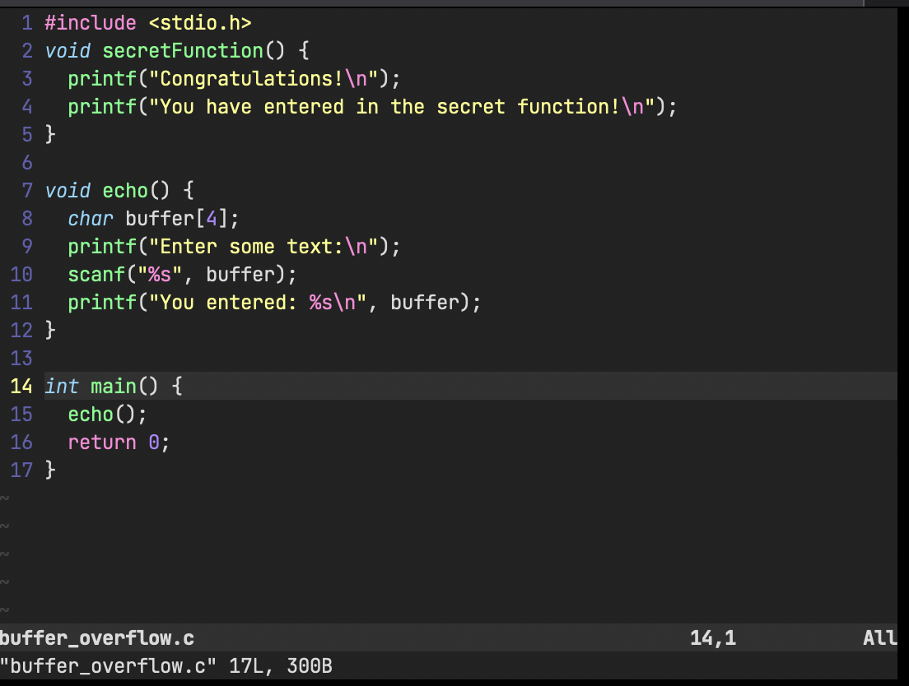

functions echo 的 scanf 没有对输入的buffer 大小做限制而用户可以输入超长字符串覆盖函数的 return 地址，进而跳转执行 secretFunction 函数。

尝试输入：`1234AAAABBBB`

执行到地 11 行时，栈的内容：

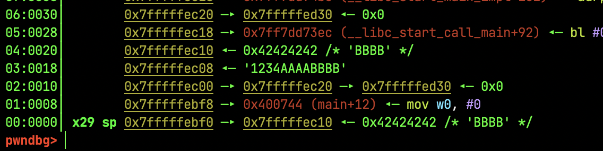

因为 `char buffer[4]` 所以溢出的部分为 `AAAABBBB`，者很好理解。


## Buffer Overflow 的本质

从 echo 返回到 main 函数会执行 ldp 指令：

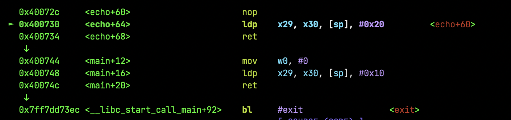


x29
When a function is called, its stack frame is typically set up to store information such as the return address, function arguments, and local variables. The frame pointer points to the base of this stack frame, allowing easy access to these values through fixed offsets from the frame pointer.

x29 通常会被设置为当前函数的栈帧底部的地址，这样可以通过偏移量相对于x29来访问局部变量和函数参数。


x30(LR):
The LR register allows the processor to return control to the correct location in the code after a function call. **When a function is called, the address of the instruction immediately following the function call is stored in the LR register.** This allows the processor to resume execution from that point once the function execution is complete.

执行之前的 x29 和 x30 寄存器
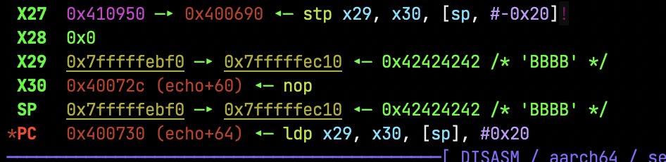


执行之前的栈如下，`$ stack -i 20` 显示：
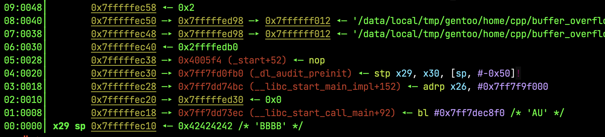


After：
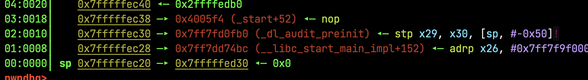


可见栈空间向下扩展 `0x10`（ 0x7fffffec20 = 0x7fffffec10 + 0x10）
```sh
pwndbg> x/i 0x7ff7dec8f0  
0x7ff7dec8f0 <__GI_exit>:    stp     x29, x30, [sp, #-16]!                                                                
```
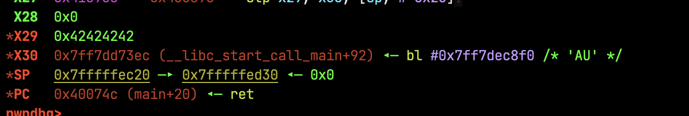

原来的 sp 变成了 x29, x30 = 原sp - 0x8

X30 也就是 LR 指向了 `<__GI_exit>`

```sh
pwndbg> x/i 0x7ff7dec8f0  
0x7ff7dec8f0 <__GI_exit>:    stp     x29, x30, [sp, #-16]!
```
看到 ` stp     x29, x30,` 表示这又是某个函数的开头。

这非常好理解，因为 echo 的返回值为 return 0, GCC 把它认为是 exit(0)，基 exit 是 glibc 提供的退出函数，It performs various cleanup tasks, such as flushing streams, closing files, and calling functions registered with the atexit or on_exit functions. After cleanup, exit terminates the program execution and returns control to the operating system.

如果 stepi 的，会发现转入了 `glibc-2.38/sysdeps/nptl/libc_start_call_main.h` 中的 `__libc_start_call_main` 运行：

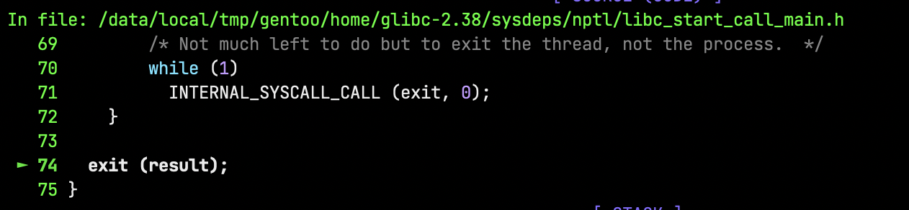


main 函数 return 时：
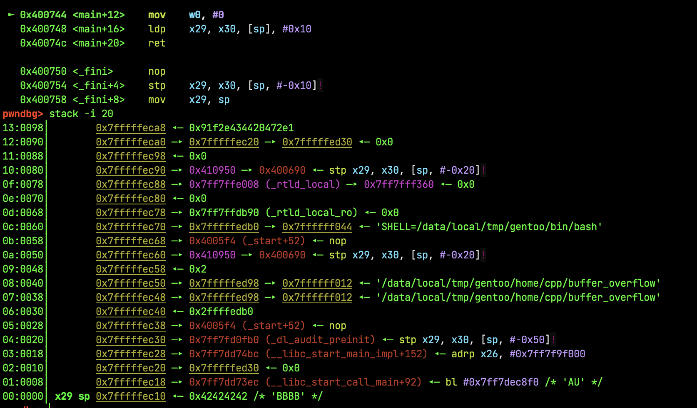

```
  ldp    x29, x30, [sp], #0x10  
```
执行完成后:
1. x29 = sp
2. x30 = sp + 0x8 
3. sp = sp + 0x10

这里关键是 x30 的值如何，决定了main 函数 return 到哪里去，我们可以计算一下  x30 的值，显然为 0x7ff7dd73ec（sp=0x7fffffec10,sp-0x8 ）而 0x7ff7dd73ec 为 libc.so.6 中的 .text 
对应的函数为：

```sh
0x7ff7dd73ec <__libc_start_call_main+92>:       0x94005541
```

最后程序正常退出：

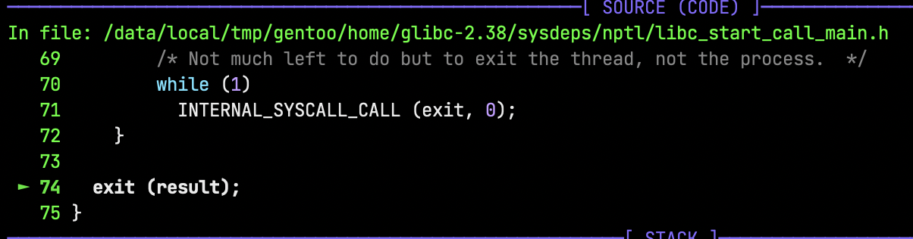

这没什么问题，1234AAAABBBB 最终并不会造成程序异常退出，因为 payload 的长度并不足以覆盖到 main函数的 return 地址，本质上是执行到 `ldp    x29, x30, [sp], #0x10 ` 的时候，payload 并不会影响到 x30 计算后的值。

本质上，buffer overflow 可以看作是对 LR 寄存器的覆盖，你覆盖了LR寄存器，就可以控制程序跳转到你想要的地方去执行。

### 动手覆盖 main 函数的返回地址

关键在这个地方：
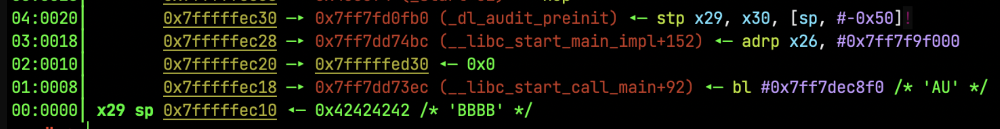

我们知道 一切源于这条指令：`  ldp    x29, x30, [sp], #0x10 `：
1. x29 = sp
2. x30 = sp + 0x8 
3. sp = sp + 0x10

1234AAABBBB 还不足以覆盖到栈地址 0x7fffffec18（sp + 0x8 ），在 aarch64 中，指针长度为 `long *`，也就是 8 字节，所以payload 需要适当增加，接下来组装 payload，8字节一组：
```
[1234AAAA] [BBBBCCCC] [DDDDEEEE] 
```

理论上DDDDEEEE能填充到 0x7fffffec18 + 0x8 的区域，传入`1234AAAABBBBCCCCDDDDEEE`，在 main 函数的 return 处停止，此时栈：

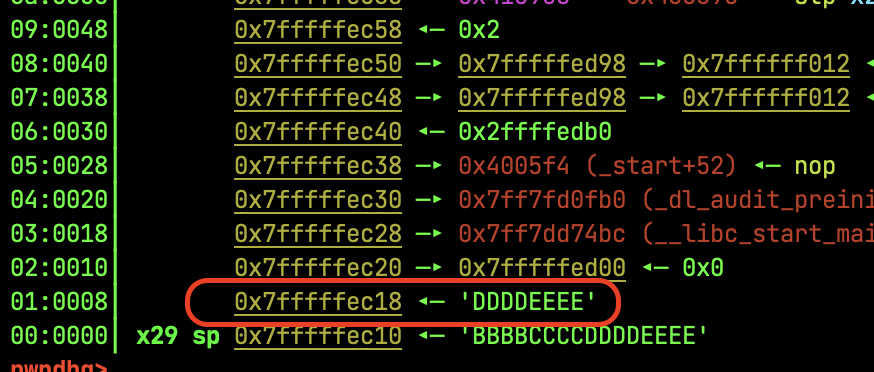

理论上执行 `ldp    x29, x30, [sp], #0x10` 后，X30（LR）寄存器的值就成了 DDDDEEEE：

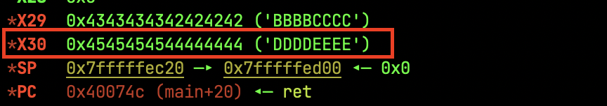

使用任何一个 Hex 编辑器将 DDDDEEEE 改为 secrtFunction 的函数开始地址：
