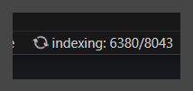
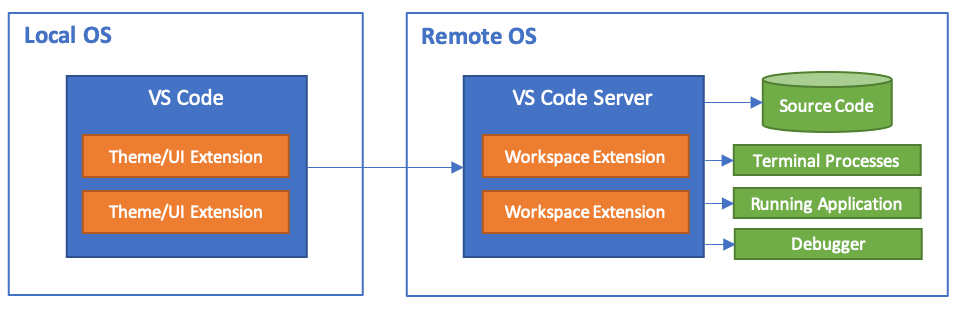
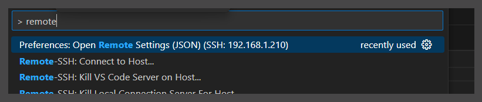
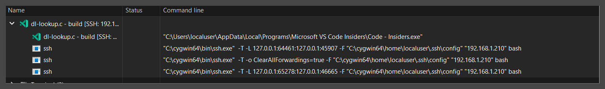
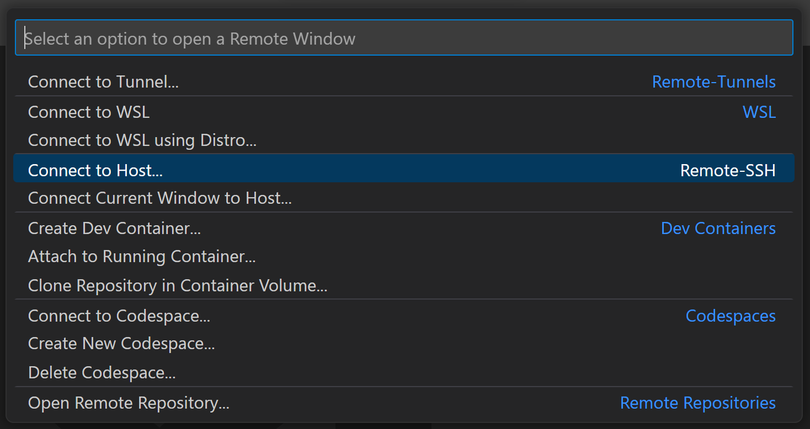
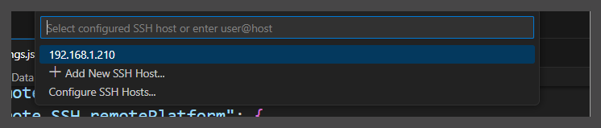
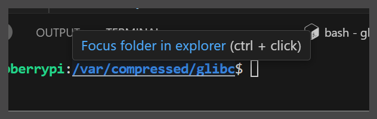

> 以 GLIBC 为例，搭建二进制与源码调试环境

<!--more-->

### Build glibc With debug symbol

首先搞清楚系统自带的 libc.so 版本信息，然后构建相同版本的 glibc，我 Gentoo Portage 自带的 glibc 版本为 2.38：

```sh
$ /lib64/libc.so.6
GNU C Library (Gentoo 2.38-r8 (patchset 9)) stable release version 2.38.
Copyright (C) 2023 Free Software Foundation, Inc.
This is free software; see the source for copying conditions.
There is NO warranty; not even for MERCHANTABILITY or FITNESS FOR A
PARTICULAR PURPOSE.
Compiled by GNU CC version 13.2.1 20231216.
libc ABIs: UNIQUE ABSOLUTE
Minimum supported kernel: 3.7.0
For bug reporting instructions, please see:
<https://bugs.gentoo.org/>.
```
glibc 源码在 https://ftp.gnu.org/gnu/glibc 发行： 
```sh
$ wget https://ftp.gnu.org/gnu/glibc/glibc-2.38.tar.bz2
$ tar -xvf glibc-2.38.tar.bz2;rm glibc-2.38.tar.bz2
$ cd glibc
$ ../configure --prefix=/home/ihexon/glibc_bin --enable-profile
```
我使用 `clangd` 作为语言服务器为上层 Editor 提供 IDE 类似的 `GoTo/GoRefer/GoToDefinition/GoToSymbol` 与 Auto completion 等功能，`Clangd` 需要 `compile_commands.json` 对 source code 进行 index，所以还需要使用 Bear 来生成 `compile_commands.json`：

```sh
$ bear -- make -j4
$ make -j4; make  install
```

> [Bear](https://github.com/rizsotto/Bear) is a tool that generates a compilation database for Clang tooling. 
> Bear 的内部原理是通过预加载动态链接库的方式来拦截编译器的调用，Bear 使用 `LD_PRELOAD` 环境变量，通过在编译器执行前加载一个共享库，将共享库中的特定函数替换为自定义实现，从而截获编译器的调用，这是一种在运行时劫持函数调用的技术。Bear 生成的 `compile_database.json` 记录了整个源码目录的编译过程信息，`clangd` 使用这些信息来对源码进行补全，跳转，诊断等。


> Bear 使用了 gRPC 调用，所以当前环境下不能有 http(s)_proxy 或者类似的环境变量。


使用 readelf 查看 libs.so.6 的 .debug sections
```sh
$ readelf -S libc.so --wide
 [58] .debug_aranges    PROGBITS        0000000000000000 183e80 016390 00      0   0 16
  [59] .debug_info       PROGBITS        0000000000000000 19a210 5106dc 00      0   0  1
  [60] .debug_abbrev     PROGBITS        0000000000000000 6aa8ec 0e5ca5 00      0   0  1
  [61] .debug_line       PROGBITS        0000000000000000 790591 13056f 00      0   0  1
  [62] .debug_str        PROGBITS        0000000000000000 8c0b00 02cd09 01  MS  0   0  1
  [63] .debug_line_str   PROGBITS        0000000000000000 8ed809 00ae2a 01  MS  0   0  1
  [64] .debug_loclists   PROGBITS        0000000000000000 8f8633 16042f 00      0   0  1
  [65] .debug_rnglists   PROGBITS        0000000000000000 a58a62 0230b8 00      0   0  1
```


GLIBC 源码使用了许多复杂的 Macro，分析这些 Macro 需要一定的耐心与难度， GDB 可以使用 `macro expand (MACRO_NAME(PARAM)` 打印展开后的 Macro，但是需要编译期间添加 `-g3` 支持，且 GCC 最低需要支持 DWARF 版本 3（`-gdwarf-3`）。

我本地的 GCC 版本为 `13.2.1 20231216 (Gentoo 13.2.1_p20231216 p11)`， 默认 DWARF 格式为 5，所以我只需要在 运行 configure 脚本之前加入环境变量 `CFLAGS="-g3"` 就行。

`-g3` 存储了许多额外的调试信息会导致构建出来的 glibc 二进制库体积会**稍微大一些**。 


另外 glibc 需要 `-O2` 参数才能正确的构建，会有部分代码的逻辑被优化成抽象的样子，分析这部分代码只能去看汇编了，Good Luck。


## Clangd
通常情况下 Clangd 能做到开箱即用, clangd 读取 compile_commands.json 获取编译时参数分析 C++ 源码，但是如果系统自带的 clangd 版本太老的话，可以下载较新的 Clangd 二进制文件，需要在 Remote 端 VSCode 的 settings.json 中加入如下配置：

```json
"clangd.path": "/home/ihexon/clang+llvm-17.0.6-aarch64-linux-gnu/bin/clangd",
```

clangd 插件的所有可配置选项可以从 package.json 中得到：
https://github.com/clangd/vscode-clangd/blob/master/package.json

点击一个 C 文件，vscode 的 clangd 插件会运行 clangd 二进制文件对源码目录进行 index：


如果浏览一下巨大的源码目录，比如 qemu 或者 kernel 时，clangd 会开始吃满服务器的CPU，并造成磁盘占用率 100%。

clangd 生成的 index 文件 存储在源码目录下的 `.cache` 内，如果内存比较空闲的话可以把这个文件夹移动到内存中如 `/dev/shm`，使用 ln 将 /dev/shm/.cache 链接到源码目录内来避免 100% 磁盘占用的情况。

Clangd 有自己的配置文件 `~/.config/clangd/config.yaml`（注意不是VSCode Clangd 插件），如果遇到 clangd 找不到 Header 的情况，需要手动给 clangd 提供 Header 的路径：
```
CompileFlags: 
 Add: [ -I/usr/include/ , -Wall]
 Remove: -W*
```


## VSCode 使用 Clangd 搭建开发环境

VSCode 通过一个插件来支持 Clangd 语言服务器，这样带来的好处就是非常轻量级因为文本编辑器与代码分析器分离了且整个过程都是异步的。现在集成开发环境向 LSP 发展的趋势，连 Jetbrain 是这种自研的代码引擎的也在向 LSP 架构迁移。 

> To understand your source code, clangd needs to know your build flags. (This is just a fact of life in C++, source files are not self-contained).

Clang 通过 `compile_commands.json` 来获取编译器传入的各种参数帮助clangd理解代码，并提供给文本编辑器补全，诊断，跳转等能力。`compile_commands.json` 一般是通过 Bear 或者 Cmake 等工具生成的。

Clangd 会向上级目录逐级搜索 compile_commands.json，同时也会向同级 `build` 目录搜索。这么说有点抽象，举个例子：
If editing `$SRC/gui/window.cpp`, clangd search in : 

```sh
$SRC/gui/, 
$SRC/gui/build/, 
$SRC/, 
$SRC/build/, 
…
```

所以如果需要在同一个 VSCode 实例中同时翻阅多个项目的代码，可以把这些 `compile_commands.json` 都组织好，然后写一个 C 语言的 HelloWord 触发 Clangd 寻找各个项目的 compile_commands.json，毕竟 Life is short ：）

### VSCode

VSCode 远程开发架构




简单讲就是本地 VSCode 主 UI 线程会启动一个新的 UI 线程链接远程的 VSCode Server，代码分析补全跳转主要由远程 VSCode Server 负责。而新的 UI 线程可以看作是 VSCode Server 的前端界面。


### 快捷键
- Crtl-P 类似于 Jetbrains IDEs 中的 Double-Shift，可以搜索一些代码与 Action
- 鼠标右键会有 Keyboard Mapping 提示。

### 快速编辑 settings.json
CTRL-P，搜索 JSON 可以快速编辑本地/远程/远程 Workspace 的 settings.json 文件



### 重要的目录文件
#### 远程主机上比较重要的目录文件：
- `~/.vscode-server-insiders/`：远程 vscode 的安装目录。
- `~/.vscode-server-insiders/data/Machine/settings.json`: 远程VSCode 的配置文件
- `~/glibc/build/.vscode/settings.json`：glibc 下的 vscode 配置，项目级别的配置会覆盖 `~/.vscode-server-insiders/data/Machine/settings.json` 下的配置。
    - `~/glibc/build/.vscode/launch.json` Debug 配置

我这里贴一份 settings.json 备忘：

```json
$ cat  .vscode-server-insiders/data/Machine/settings.json
{

    "clangd.path": "/home/ihexon/clang+llvm-17.0.6-aarch64-linux-gnu/bin/clangd",
    "search.exclude": {
        "**/.cache": true
    },
    "files.exclude": {
        "**/.cache": true
    },
    "C_Cpp.intelliSenseEngine": "disabled",
    "remote.SSH.remoteServerListenOnSocket": true,
    "C_Cpp.files.exclude": {
        "**/.vscode": true,
        "**/.cache": true,
        "**/.vs": true
    },
    "C_Cpp.codeAnalysis.exclude": {
        "**/.cache": true
    }
}
```


```json
$ cat /var/compressed/glibc/build/.vscode/settings.json
{

    "clangd.path": "/home/ihexon/clang+llvm-17.0.6-aarch64-linux-gnu/bin/clangd",
    "C_Cpp.intelliSenseEngine": "disabled",
    "C_Cpp.codeAnalysis.exclude": {
        "**/.cache": true
    },
    "search.exclude": {
        "**/node_modules": true,
        "**/bower_components": true,
        "**/*.code-search": true,
        "**/.cache":true
    },
    "C_Cpp.default.compileCommands": "/tmp/glibc/build/compile_commands.json",
}
```

#### 本地 VSCode 的重要文件：

- `C:\Users\localuser\AppData\Roaming\Code - Insiders\User` 本地 VScode 目录


#### 避免触发 SSH Timeout 的 BUG

这是 VSCode 的古董级 BUG 了，**到现在仍然没修**，使用 `remote.SSH.useLocalServer` 可以缓解 BUG 的出现。

```json
    "remote.SSH.useLocalServer": true,
```

但有时候还是会触发。管道所有的 VSCode 窗口（远程的 UI，本地的 UI）后重新打开发现远程的 Workspace 又正常了。

在触发这个 BUG 的时候注意 VSCode OUT 窗口的日志输出，发现报错输出一堆 JS 文件的异常信息，但这似乎不是重点。

通过 TaskViewer 观察到关闭远程 VSCode UI 后 SSH 没有被杀死： 




这显然会导致新的远程 VSCode UI 下的 SSH 端口映射失败。

哈搞了半天原来是这个原因，并且 Window 上的 SSH 客户端在端口转发失败的情况下还不会报错，**真的太善良了好吗？？**

可以使用 `cygwin` 里的 `OpenSSH` 套件代替Win11 自带的 SSH，编辑本地 VSCode 配置文件加上这些配置：
```json
# In C:\Users\localuser\AppData\Roaming\Code - Insiders\User
{
    "remote.SSH.enableX11Forwarding": false,
    "remote.SSH.enableDynamicForwarding": false,
    "remote.SSH.enableAgentForwarding": false,
    "remote.SSH.path": "C:\\cygwin64\\bin\\ssh.exe",
    "remote.SSH.configFile": "C:\\cygwin64\\home\\localuser\\.ssh\\config",
}
```

### 打开 glibc 工程

#### 配置 VSCode 的 SSH 登录信息

在 Cygwin 中使用密钥对登录服务器
```
$ ssh-copy-id  -p2222 ihexon@192.168.1.210 # 
```
写入登录配置信息到 Cgwin 的 `~/.ssh/config` 文件内 
```
$ cat ~/.ssh/config
Host 192.168.1.210
  HostName 192.168.1.210
  Port 2222
  User ihexon
```

注意这里服务器的的别名就是 `192.168.1.210`


之前我加入的 `remote.SSH.path` 配置会让 VScode 寻找到 cygwin 中的ssh 二进制文件而不是使用 Win11 自带的 SSH。

而 `remote.SSH.configFile`  让 VScode 使用使用 Cygwin `$HOME/.ssh/config` 中的配置来登录远程服务器：
```json
 "remote.SSH.path": "C:\\cygwin64\\bin\\ssh.exe",
 "remote.SSH.configFile": "C:\\cygwin64\\home\\localuser\\.ssh\\config",
```
使用 VSCode 链接到远程服务器：



更详细的步骤参考: https://code.visualstudio.com/docs/remote/SSH-tutorial


链接到远程主机后 VSCode 是空白的，因为当前没有打开的源码目录。

但如果 File - Open Folder 打开 glibc 目录又会触发 SSH Timeout 的 BUG，因为 VSCode 会再次尝试进行端口映射，而这次必然会映射失败。此时要么就关闭所有的 VScode 实例，SSH 会被杀死，下次启动的时候就能成功打开 glibc 源码目录。

或者从 Terminal 中切换到 glibc 目录，使用 Ctrl + Click 可以在新窗口中打开，这样就没什么问题，因为这样切换到 glibc 源码目录还是在同一个 VSCode 实例操作的。



因为我使用的 Clangd 而不是 VScode 自己的 intelliSenseEngine，所以我需要将 远程 VSCode 的 intelliSenseEngine 设置为 Disable ：
```
 "C_Cpp.intelliSenseEngine": "disabled",
```
