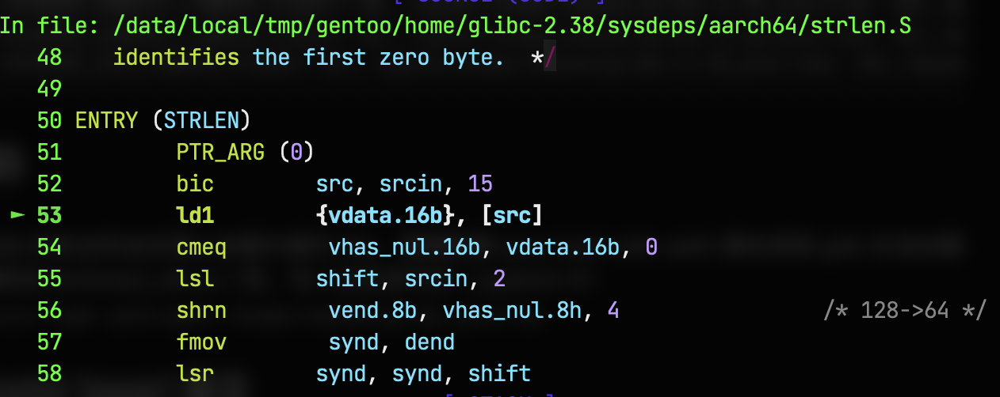
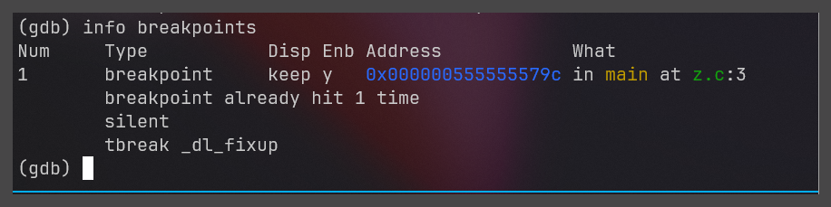
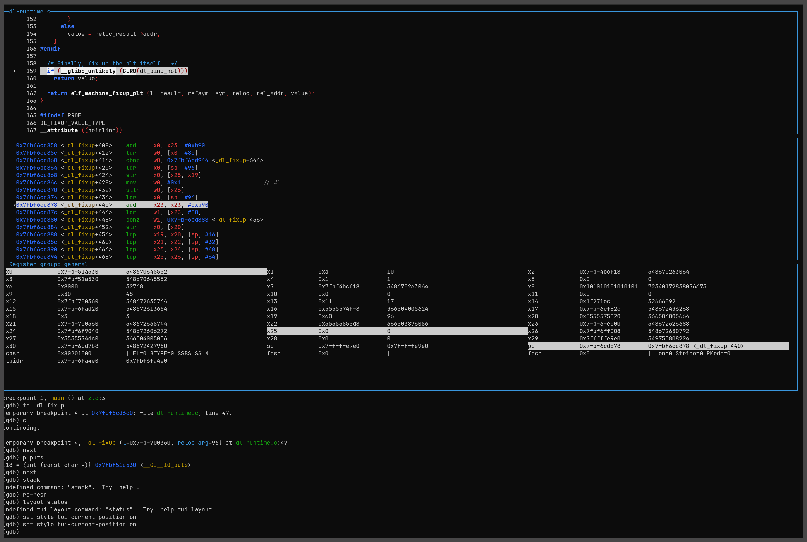

整理 GDB、GCC、Binutils 相关调试笔记，包括 CMake 参数、链接选项和符号调试环境。

<!--more-->


```bash
-g3 -ggdb -O0 # 加入调试符号，关闭优化
-fno-stack-protector -no-pie 
```
```sh
-Wl,-dynamic-linker=/data/local/tmp/gentoo/home/glibc-2.38_bin/lib/ld-linux-aarch64.so.1
-Wl,-rpath=/data/local/tmp/gentoo/home/glibc-2.38_bin/lib
```

```sh
-fno-builtin-printf
-fstack-protector-all 
-fpic 
-pie 
-march=armv8-a+crc 
-pipe

```


在某些使用 CMAKE 构建的项目中，如有需要可以直接设置 `CFLAGS，CXXFLAGS` 环境变量，CMAKE会找到这些环境变量并加入最终生成的 Makefile 中。而链接时的尝试可以通过 `DCMAKE_MODULE_LINKER_FLAGS/DCMAKE_MODULE_LINKER_FLAGS/DCMAKE_SHARED_LINKER_FLAGS/DCMAKE_EXE_LINKER_FLAGS` 来控制：

```cmake
$ set -x CFLAGS "-ggdb -g3 -gdwarf -gdwarf-5"
$ set -x CXXFLAGS "-ggdb -g3 -gdwarf -gdwarf-5"

$ cmake -B build \
    -DCMAKE_EXPORT_COMPILE_COMMANDS=ON \
    -DCMAKE_MODULE_LINKER_FLAGS="-Wl,-rpath=/home/ihexon/glibc-2.35_bin/lib/ -Wl,-dynamic-linker=/home/ihexon/glibc-2.35_bin/lib/ld-linux-aarch64.so.1" \
    -DCMAKE_SHARED_LINKER_FLAGS="-Wl,-rpath=/home/ihexon/glibc-2.35_bin/lib/ -Wl,-dynamic-linker=/home/ihexon/glibc-2.35_bin/lib/ld-linux-aarch64.so.1" \
    -DCMAKE_EXE_LINKER_FLAGS="-Wl,-rpath=/home/ihexon/glibc-2.35_bin/lib/ -Wl,-dynamic-linker=/home/ihexon/glibc-2.35_bin/lib/ld-linux-aarch64.so.1"
```

## GDB

### 常见警告
由于 GDB 的安全性设定禁止加载外部的 libs，需要配置 auto-load safe-path 路径否则 GDB 无法加载到外部库如 libthread_db.so.1 等。写入这条语句到 ~/.gdbinit 中：
```sh
set auto-load safe-path /data/local/tmp/gentoo/home/glibc-2.38_bin/lib/
```
如果要使用独立的 libpthread_db.so 需要设置 libthread-db-search-path，如：
```sh
set libthread-db-search-path /data/local/tmp/gentoo/home/glibc-2.38_bin/lib/
```

**注意**：`set libthread-db-search-path /data/local/tmp/gentoo/home/glibc-2.38_bin/lib/` 不能写成 `set libthread-db-search-path "/data/local/tmp/gentoo/home/glibc-2.38_bin/lib/"` (没有 \" \") ！


GDB 调试遇到警告：
> warning: Error disabling address space randomization: Operation not permitted

```
gdb$ set disable-randomization off
```
If you running GDB inside docker:
```
docker run --cap-add=SYS_PTRACE --security-opt seccomp=unconfined
```


### call/print [expr] 指令
评估表达式 expr 并显示结果值，expr 也包括对程序中函数的调用。

GDB 会为 expr 创建 dummy frame，这个 frame 不属于被调试程序的 frame。
但是 expr 可以访问和修改程序的运行时数据，所以 expr 编写不当会对程序产生一些非预期的副作用。


通过 print 或 call 命令调用的函数可能会生成信号（例如，如果函数中存在错误，或者传递了不正确的参数）。在这种情况下，可以通过 set unwindonsignal 命令来控制发生的情况，比如
```c
call printf("%s", 0x111111)
```
这显然会造成程序  Segmentation fault，因为 0x11111 并不受有效的VMA地址，GDB eval 这条代码后 GDB 立即收到 SIGSEGV 信号，此时 GDB 有两种行为取决于 unwindonsignal 的开关状态，
```c
set unwindonsignal off 
```
GDB 将停在接收信号的帧中，此时尝试 continue 可以发现 GDB 停在了这里

但异常处理又是另外的话题了不在这里解释。

```c
set unwindonsignal on 
```
GDB将展开其为调用创建的堆栈，并将上下文恢复到收到 SIGSEGV 信号之前的状态。


If a called function is interrupted for **any reason**, including **hitting a breakpoint, or triggering a watchpoint**, and the stack is not unwound due to set unwind-on-terminating-exception on or set unwindonsignal on (see stack unwind settings), then the dummy-frame, created by GDB to facilitate the call to the program function, will be visible in the backtrace, for example frame #3 in the following backtrace:

```
(gdb) backtrace
#0  0x00007ffff7b3d1e7 in nanosleep () from /lib64/libc.so.6
#1  0x00007ffff7b3d11e in sleep () from /lib64/libc.so.6
#2  0x000000000040113f in deadlock () at test.cc:13
#3  <function called from gdb>
#4  breakpt () at test.cc:20
#5  0x0000000000401151 in main () at test.cc:25
At this point it is possible to examine the state of the inferior just like any other stop.
```


### TUI
如果你不想安装 pwndbg 或者环境受限，GDB 也自带 tui 界面帮助调试。

https://sourceware.org/GDB/current/onlinedocs/GDB.html/TUI.html#TUI

```bash
C-x C-a ：Enter or leave the TUI mode.
C-x o   ：Change the active window.
C-L     ：Refresh the screen.

gdb > set style tui-current-position on
```

GDB 可以自定义 Layout，比如我想让窗口变成 4 栏，分别是 src,asm,regs。每个窗口大小为 10 height，layout 的名字叫 ihexon_layout。

```bash
tui new-layout ihexon_layout src 10 regs 10 asm 10  status 1 cmd 10
tui layout ihexon_layout 

# 改变 src 和 asm 排列方式，高度为20行
tui new-layout ihexon_layout { -horizontal src 10 asm 10 } 20 regs 10 status 1 cmd 30
```

分离窗口后想要再次回到 cmd 窗口中需要：`focus cmd`


### breakpoint
`b` 没什么好说的，断点就是乱打，打不中就继续瞎JB下断点。


`_dl_fixup` 在 hit 到 `main` 函数后中断：

```
break main
commands
silent
tbreak _dl_fixup
end
```






layout 可能会因为Terminal 变得混乱，使用 `tui refresh` 重新绘制 layout。


```bash
# 使用 GDB 的内置计算器进行十六进制相加
# 例如，计算 0x10 + 0x20
> p/x 0x10 + 0x20
> printf "0x%x\n", 0x10 + 0x20

# 如果你想查看函数 + 偏移量处的汇编代码，使用具体的地址
# 这里的地址是函数地址 + 偏移量
> disassemble _dl_audit_preinit+0xfc8


# 使用 print 来打印 0x000000000400200 字符串
> print  --  (char*)0x000000000400200
# print 支持额外的打印参数，可以通过 help print 查看，注意 -- 分隔符的位置
> print  -pretty on  -address on  -null-stop on  -array on   -array-indexes on --  (char*)0x000000000400200
# 使用 x  来打印 0x000000000400200 字符串
> x/s 0x000000000400200
0x400200:       "/lib/ld-linux-aarch64.so.1"
# 当然也可以单个字符串打印
> x/c 0x000000000400200
0x400200:       47 '/'
```
