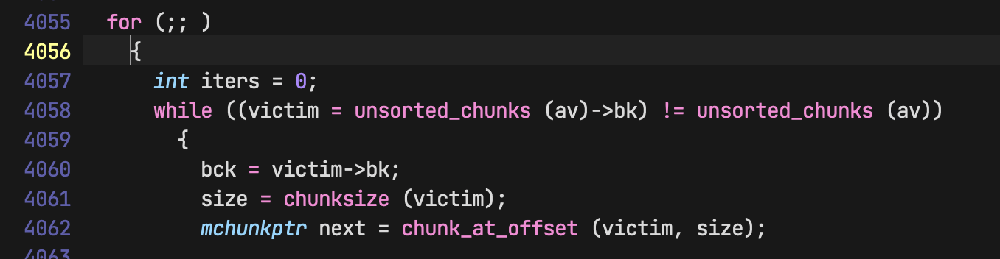
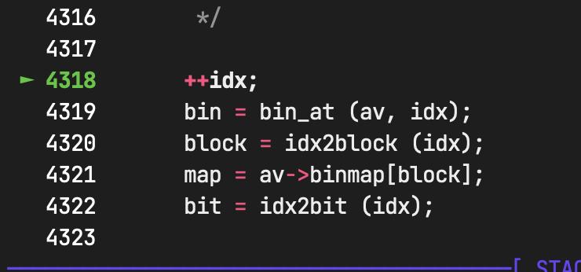
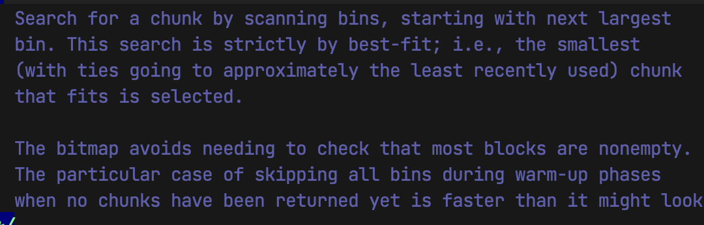
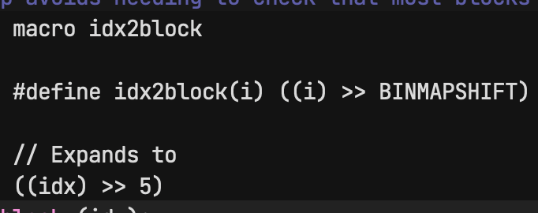
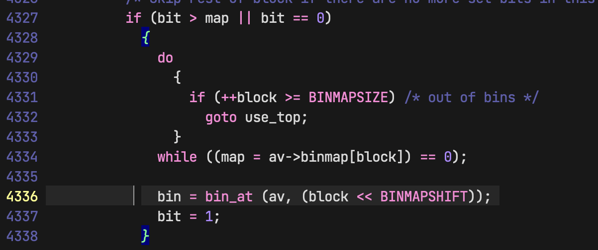

围绕 GLIBC ptmalloc，记录 tcache、smallbins、malloc 路径和堆结构的调试分析。

<!--more-->

## GLIBC 版本：
```
commit 36f2487f13e3540be9ee0fb51876b1da72176d3f (grafted, HEAD, tag: glibc-2.38)
Author: Andreas K. Hüttel <dilfridge@gentoo.org>
Date:   Mon Jul 31 19:54:16 2023 +0200

    NEWS: Fix typos

    Signed-off-by: Andreas K. Hüttel <dilfridge@gentoo.org>
```
## __libc_malloc 走马观花

一个运行中程序中的 bins 
```sh
pwndbg> bins

tcachebins
0x20 [  1]: 0xba6ff66bac80 ◂— 0x0
0x30 [  1]: 0xba6ff66cc990 ◂— 0x0
0x60 [  1]: 0xba6ff66bdde0 ◂— 0x0
0x70 [  2]: 0xba6ff66cebc0 —▸ 0xba6ff66a4c00 ◂— 0x0
0x80 [  1]: 0xba6ff66a6ff0 ◂— 0x0
0xa0 [  1]: 0xba6ff66bfd30 ◂— 0x0
0xb0 [  2]: 0xba6ff66a34f0 —▸ 0xba6ff66d0390 ◂— 0x0
0xe0 [  1]: 0xba6ff66a3410 ◂— 0x0
0xf0 [  1]: 0xba6ff66ad7a0 ◂— 0x0
0x100 [  1]: 0xba6ff66d0460 ◂— 0x0
0x110 [  1]: 0xba6ff66c88c0 ◂— 0x0
0x120 [  1]: 0xba6ff66a8bf0 ◂— 0x0
0x140 [  1]: 0xba6ff66a26b0 ◂— 0x0
0x1d0 [  1]: 0xba6ff66a27f0 ◂— 0x0
0x1e0 [  1]: 0xba6ff66ad5c0 ◂— 0x0
0x230 [  1]: 0xba6ff66b64f0 ◂— 0x0
0x260 [  2]: 0xba6ff66c6630 —▸ 0xba6ff66a8910 ◂— 0x0
0x270 [  1]: 0xba6ff66a29c0 ◂— 0x0
0x280 [  1]: 0xba6ff66c6920 ◂— 0x0
0x290 [  1]: 0xba6ff66c1b40 ◂— 0x0
0x2a0 [  2]: 0xba6ff66b6720 —▸ 0xba6ff66a6960 ◂— 0x0
0x2c0 [  1]: 0xba6ff66ce7d0 ◂— 0x0
0x2d0 [  1]: 0xba6ff66bdb10 ◂— 0x0
0x300 [  1]: 0xba6ff66b8570 ◂— 0x0
0x310 [  1]: 0xba6ff66d8650 ◂— 0x0
0x340 [  1]: 0xba6ff66a48a0 ◂— 0x0
0x370 [  1]: 0xba6ff66bc1c0 ◂— 0x0
0x380 [  1]: 0xba6ff66a4520 ◂— 0x0
0x3d0 [  1]: 0xba6ff66ba8b0 ◂— 0x0
0x3f0 [  1]: 0xba6ff66a6c00 ◂— 0x0
0x410 [  1]: 0xba6ff66d9960 ◂— 0x0
fastbins
empty
unsortedbin
all: 0xba6ff66b9690 —▸ 0xe1b9d1800ab0 (main_arena+96) ◂— 0xba6ff66b9690
smallbins
0x20: 0xba6ff66c8890 —▸ 0xba6ff66d0430 —▸ 0xba6ff66a4bd0 —▸ 0xe1b9d1800ac0 (main_arena+112) ◂— 0xba6ff66c8890
0x40: 0xba6ff66a44d0 —▸ 0xba6ff66bc170 —▸ 0xe1b9d1800ae0 (main_arena+144) ◂— 0xba6ff66a44d0
0x50: 0xba6ff66bdab0 —▸ 0xba6ff66a3590 —▸ 0xe1b9d1800af0 (main_arena+160) ◂— 0xba6ff66bdab0
0x60: 0xba6ff66a88a0 —▸ 0xba6ff66ce760 —▸ 0xe1b9d1800b00 (main_arena+176) ◂— 0xba6ff66a88a0
0x70: 0xba6ff66a3390 —▸ 0xba6ff66bc520 —▸ 0xe1b9d1800b10 (main_arena+192) ◂— 0xba6ff66a3390
0x80: 0xba6ff66a8b60 —▸ 0xe1b9d1800b20 (main_arena+208) ◂— 0xba6ff66a8b60
0x90: 0xba6ff66c6880 —▸ 0xe1b9d1800b30 (main_arena+224) ◂— 0xba6ff66c6880
0xa0: 0xba6ff66c1a90 —▸ 0xe1b9d1800b40 (main_arena+240) ◂— 0xba6ff66c1a90
0xe0: 0xba6ff66d9870 —▸ 0xe1b9d1800b80 (main_arena+304) ◂— 0xba6ff66d9870
0x130: 0xba6ff66cea80 —▸ 0xe1b9d1800bd0 (main_arena+384) ◂— 0xba6ff66cea80
0x170: 0xba6ff66a67e0 —▸ 0xe1b9d1800c10 (main_arena+448) ◂— 0xba6ff66a67e0
0x180: 0xba6ff66b83e0 —▸ 0xe1b9d1800c20 (main_arena+464) ◂— 0xba6ff66b83e0
0x1f0: 0xba6ff66bd0c0 —▸ 0xe1b9d1800c90 (main_arena+576) ◂— 0xba6ff66bd0c0
0x2a0: 0xba6ff66d00e0 —▸ 0xe1b9d1800d40 (main_arena+752) ◂— 0xba6ff66d00e0
0x2d0: 0xba6ff66a6220 —▸ 0xe1b9d1800d70 (main_arena+800) ◂— 0xba6ff66a6220
0x2e0: 0xba6ff66aeaf0 —▸ 0xe1b9d1800d80 (main_arena+816) ◂— 0xba6ff66aeaf0
largebins
0x980-0x9b0: 0xba6ff66bf390 —▸ 0xe1b9d1801000 (main_arena+1456) ◂— 0xba6ff66bf390
0x3000-0x3ff0: 0xba6ff66c89c0 —▸ 0xe1b9d18011b0 (main_arena+1888) ◂— 0xba6ff66c89c0
0x4000-0x4ff0: 0xba6ff66a8d00 —▸ 0xba6ff66c1dc0 —▸ 0xe1b9d18011c0 (main_arena+1904) ◂— 0xba6ff66a8d00
0x7000-0x7ff0: 0xba6ff66aeff0 —▸ 0xe1b9d18011f0 (main_arena+1952) ◂— 0xba6ff66aeff0
0x8000-0x8ff0: 0xba6ff66d0550 —▸ 0xe1b9d1801200 (main_arena+1968) ◂— 0xba6ff66d0550
pwndbg>
```


```
// 这tcache 中的某条 bins 链表，由大小为 0x260 的 chunks 组成，链表头地址为 0xba6ff66c6630
0x260               [  2]   : 0xba6ff66c6630 —▸ 0xba6ff66a8910 ◂— 0x0
chunk 大小   tcache.counts     头节点
```

这是 smallbins 中的第一条 bins 链表，由大小为 0x20 的 chunks 组成，头节点的地址为 0xba6ff66c8890，末尾节点指向了头节点，表示这是一条循环链表。

```
smallbins
0x20: 0xba6ff66c8890 —▸ 0xba6ff66d0430 —▸ 0xba6ff66a4bd0 —▸ 0xe1b9d1800ac0 (main_arena+112) ◂— 0xba6ff66c8890
```
0xba6ff66c8890 地址并不是 chunk 的开始地址，而是用户数据地址，假如这条链表的叫 node1，那么 node1->next 指向 0xba6ff66d0430，`ode1->next` 的地址为 0xba6ff66c8890 + 0x10
```
pwndbg> x 0xba6ff66c8890 + 0x10

0xba6ff66c88a0: 0x0000ba6ff66d0430
```


## malloc(535)

首先对 535 进行对齐，然后 csize2tidx 计算 tc_idx 的值：
```c
// malloc/malloc.c
3293 size_t tbytes = checked_request2size (bytes);
3299 size_t tc_idx = csize2tidx (tbytes);
```

checked_request2size：对用户请求的大小进行对齐，达到chunk 要求的标准大小。而 tc_idx 是 tcache 链表的索引，这个索引通过 csize2tidx 计算得到。

checked_request2size：
```c
  1317 static inline size_t
  1318 checked_request2size (size_t req) __nonnull (1)
  1319 {
  1320   if (__glibc_unlikely (req > PTRDIFF_MAX))
  1321     return 0;
  1322
  1323   /* When using tagged memory, we cannot share the end of the user
  1324      block with the header for the next chunk, so ensure that we
  1325      allocate blocks that are rounded up to the granule size.  Take
  1326      care not to overflow from close to MAX_SIZE_T to a small
  1327      number.  Ideally, this would be part of request2size(), but that
  1328      must be a macro that produces a compile time constant if passed
  1329      a constant literal.  */
  1330   if (__glibc_unlikely (mtag_enabled))
  1331     {
  1332       /* Ensure this is not evaluated if !mtag_enabled, see gcc PR 99551.  */
  1333       asm ("");
  1334
  1335       req = (req + (__MTAG_GRANULE_SIZE - 1)) &
  1336       ~(size_t)(__MTAG_GRANULE_SIZE - 1);
  1337     }
  1338
  1339   return request2size (req);
  1340 }
```

request2size 是一个宏：
```c
  1 macro request2size
  2
  3 #define request2size(req)                                                     \
  4   (((req) + SIZE_SZ + MALLOC_ALIGN_MASK < MINSIZE)                            \
  5        ? MINSIZE                                                              \
  6        : ((req) + SIZE_SZ + MALLOC_ALIGN_MASK) & ~MALLOC_ALIGN_MASK)
```

csize2tidx 也是一个宏：
```c
macro csize2tidx
Type: size_t (aka unsigned long)
#define csize2tidx(x) \
     (((x) -MINSIZE + MALLOC_ALIGNMENT - 1) / MALLOC_ALIGNMENT)
```

checked_request2size 是 inline 函数，request2size 是 macro，这就导致难以调试，csize2tidx 也是如此。


观察输出的最好方法就是使用 GCC 完全展开这两个宏，包裹进函数里，这样就可以迅速得到一张 checked_request2size & csize2tidx 的返回值表，具体看 main 函数：

```c
#include "includd.h"
#include <stdio.h>
size_t csize2tidx(size_t tbytes) {
       return (((tbytes) -
          (unsigned long)((
              ((__builtin_offsetof(struct malloc_chunk, fd_nextsize)) +
               ((2 * (sizeof(size_t)) < __alignof__(long double)
                     ? __alignof__(long double)
                     : 2 * (sizeof(size_t))) -
                1)) &
              ~((2 * (sizeof(size_t)) < __alignof__(long double)
                     ? __alignof__(long double)
                     : 2 * (sizeof(size_t))) -
                1))) +
          (2 * (sizeof(size_t)) < __alignof__(long double)
               ? __alignof__(long double)
               : 2 * (sizeof(size_t))) -
          1) /
         (2 * (sizeof(size_t)) < __alignof__(long double)
              ? __alignof__(long double)
              : 2 * (sizeof(size_t))));

}

size_t checked_request2size(size_t bytes) {

    return (((bytes) + (sizeof(size_t)) +
              ((2 * (sizeof(size_t)) < __alignof__(long double)
                    ? __alignof__(long double)
                    : 2 * (sizeof(size_t))) -
               1) <
          (unsigned long)((
              ((__builtin_offsetof(struct malloc_chunk, fd_nextsize)) +
               ((2 * (sizeof(size_t)) < __alignof__(long double)
                     ? __alignof__(long double)
                     : 2 * (sizeof(size_t))) -
                1)) &
              ~((2 * (sizeof(size_t)) < __alignof__(long double)
                     ? __alignof__(long double)
                     : 2 * (sizeof(size_t))) -
                1))))
             ? (unsigned long)((
                   ((__builtin_offsetof(struct malloc_chunk, fd_nextsize)) +
                    ((2 * (sizeof(size_t)) < __alignof__(long double)
                          ? __alignof__(long double)
                          : 2 * (sizeof(size_t))) -
                     1)) &
                   ~((2 * (sizeof(size_t)) < __alignof__(long double)
                          ? __alignof__(long double)
                          : 2 * (sizeof(size_t))) -
                     1)))
             : ((bytes) + (sizeof(size_t)) +
                ((2 * (sizeof(size_t)) < __alignof__(long double)
                      ? __alignof__(long double)
                      : 2 * (sizeof(size_t))) -
                 1)) &
                   ~((2 * (sizeof(size_t)) < __alignof__(long double)
                          ? __alignof__(long double)
                          : 2 * (sizeof(size_t))) -
                     1));
}


int main(void){
        for(size_t bytes=0;bytes!=4096;bytes++){
                size_t tbytes = checked_request2size (bytes);
                size_t tc_idx = csize2tidx(tbytes);
                printf("bytes = %ld,tbytes = %ld, tc_idx = %ld\n",bytes,tbytes,tc_idx);

        }

}
```


这个程序用于计算 bytes 从 0-4096 的  checked_request2size & csize2tidx 的返回值。

```
bytes = 1,tbytes = 32, tc_idx = 0
bytes = 25,tbytes = 48, tc_idx = 1
bytes = 40,tbytes = 48, tc_idx = 1
bytes = 41,tbytes = 64, tc_idx = 2
bytes = 56,tbytes = 64, tc_idx = 2
bytes = 57,tbytes = 80, tc_idx = 3
bytes = 71,tbytes = 80, tc_idx = 3
bytes = 72,tbytes = 80, tc_idx = 3
bytes = 73,tbytes = 96, tc_idx = 4
bytes = 75,tbytes = 96, tc_idx = 4
....
bytes = 535,tbytes = 544, tc_idx = 32
....
```


当 bytes = 535 时，tc_idx = 32：

进到 `malloc/malloc.c:3304` 对 tc_idx 和 tcache 进行检查：
```c
 ► 3304   if (tc_idx < mp_.tcache_bins // mp_.tcache_bins = 64
   3305       && tcache != NULL
   3306       && tcache->counts[tc_idx] > 0)
     
     ...
     ...
     
  3314   if (SINGLE_THREAD_P)
  3315     {
  3316       victim = tag_new_usable (_int_malloc (&main_arena, bytes));
  3317       assert (!victim || chunk_is_mmapped (mem2chunk (victim)) ||
  3318         &main_arena == arena_for_chunk (mem2chunk (victim)));
  3319       return victim;
  3320     }
```
> 在 glibc 中，tcache_bins 是用于缓存小型内存块的线程本地缓存（Thread Local Cache，简称 tcache）的大小。在 glibc 2.33 及之后的版本中，tcache_bins 默认为 64，即每个线程的 tcache 最多可以缓存 64 种不同大小的内存块。

因为没有任何 free 操作，所以 tcache 是空的，`tcache != NULL` 检查失败，自然不会到 TCACHE 中取出 chunk，但在真实的世界中，tcache 的命中率非常高。

继续跳转到 3314 行执行，进入 `_int_malloc (&main_arena, bytes)` 中去。

它在 glibc 的 malloc 实现中用于处理大于 128KB 的内存分配请求，这个函数接收两个参数：`&main_arena` 是一个指向主内存区域（main arena）的指针，`bytes` 是要分配的内存块的字节数。


## _int_malloc 分析

根据用户请求的大小，在堆上找到合适大小的可用内存块，并返回指向该内存块的指针。


```c
// glibc-2.38/malloc/malloc.c
3832 static void *
3833 _int_malloc (mstate av, size_t bytes) 
```

传入的参数：
```c
av = 0xffffbb2c0a50 <main_arena>
bytes = 535
```

这里又出现了 `nb = checked_request2size (bytes);` 计算得到 `nb = 544`。

`glibc-2.38/malloc/malloc.c:3902` 检查 nb 是否超过了 `get_max_fast ()` 返回的值 ：

```c
// get_max_fast 计算 fastbin chunk 的最大尺寸。
3902   if ((unsigned long) (nb) <= (unsigned long) (get_max_fast ())){
    ....
}
```

对应的汇编代码：
```c
 ► 0xffffbb159ce0 <_int_malloc+56>    cmp    x21, x0

pwndbg> p $x21 // nb == 544
$110 = 544
pwndbg> p $x0 // get_max_fast() == 128 
$111 = 128
```
在 aarch64 架构，glibc 2.38 中 `get_max_fast` 返回的最大值为 128。

`if ((unsigned long) (nb) <= (unsigned long) (get_max_fast ()))` 判断不成立。

继续走到 `3965   if (in_smallbin_range (nb))`：
```c
3965   if (in_smallbin_range (nb))
   3966     {
   3967       idx = smallbin_index (nb);
   3968       bin = bin_at (av, idx);
   3969
       ...
3970       if ((victim = last (bin)) != bin)
   3971         {
```
汇编代码：
```asm
► 0xffffbb159ce8 <_int_malloc+64>    cmp    x21, #0x3ff
```

> 所以当 bytes > 1023 的时候，就会进入到 Largebin 中取出 chunk 吗？ 
也就是说 nb 小于 0x3ff（1023），尝试进入 smallbin 中取出 chunk，计算出  idx=34，bin_at 计算出对应的 smallbin 链表为 `0xffffbb2c0cc0`。

last(bin) 是一个宏：
```c
((bin)->bk)
```
但由于没有任何 free 操作，smallbins 此时是空的，显然 `bin->bk == bin`，3970 行的判断语句会失败。继续向下走：
```c
 4055   for (;; )
   4056     {
   4057       int iters = 0;
 ► 4058       while ((victim = unsorted_chunks (av)->bk) != unsorted_chunks (av))
```

`((victim = unsorted_chunks (av)->bk) != unsorted_chunks (av))` 中的 unsorted_chunks() 是一个宏：

```c
macro unsorted_chunks
#define unsorted_chunks(M) (bin_at (M, 1))

// Expands to
 ((mbinptr) (((char *) &((av)->bins[((1) - 1) * 2])) \
      - __builtin_offsetof (struct malloc_chunk, fd)))
```

根据这段宏的意思打印 fd 和 bk 的值

```c
pwndbg> p /x *((av)->bins[((1) - 1) * 2])

$125 = {
  mchunk_prev_size = 0xaaaae50376a0,
  mchunk_size = 0x0,
  fd = 0xffffbb2c0ab0,
  bk = 0xffffbb2c0ab0,
  fd_nextsize = 0xffffbb2c0ac0,
  bk_nextsize = 0xffffbb2c0ac0
}
```
> 这里也可以看出 unsorted bin 实际上是 main_arean 中 最开的第一个 bin 链表。


fd == bk，unsorted bins 为空，所以不会进到 while 循环里执行。

最好走到 4318 行：
```c
 ► 4318       ++idx;
   4319       bin = bin_at (av, idx);
   4320       block = idx2block (idx);
   4321       map = av->binmap[block];
   4322       bit = idx2bit (idx);
   4323
```
此时 ++idx = 35，而 bin=bin_at (av, 35);
```c
pwndbg> p *(av->bins[((35) -1) * 2])

$151 = {
  mchunk_prev_size = 281473821969600,
  mchunk_size = 281473821969600,
  fd = 0xffffbb2c0cd0 <main_arena+640>, <---- !!!!
  bk = 0xffffbb2c0cd0 <main_arena+640>,
  fd_nextsize = 0xffffbb2c0ce0 <main_arena+656>,
  bk_nextsize = 0xffffbb2c0ce0 <main_arena+656>
}
pwndbg> p bin

$152 = (mbinptr) 0xffffbb2c0cd0 <main_arena+640>
```
根据 &main_arean->binmap 去 largbins 中取出 chunks：
```c
  4327           if (bit > map || bit == 0)
   4328             {
   4329               do
   4330                 {
 ► 4331                   if (++block >= BINMAPSIZE) /* out of bins */
   4332                     goto use_top;
   4333                 }
   4334               while ((map = av->binmap[block]) == 0);
   4335
   4336               bin = bin_at (av, (block << BINMAPSHIFT));
   4337               bit = 1;
   4338             }
```
这里会循环 4 次，因为 av.binmap 为0，同样 largbins 是空的：
```
pwndbg> p av.binmap
$157 = {0, 0, 0, 0}
```

> binmap一共 128 bits，16字节，4个int大小，binmap 按 int 分成 4 个 block，每 个block有 32 个 bit。


紧接着走到了这个循环里：


`victim = unsorted_chunks (av)->bk) != unsorted_chunks (av)` 判断 unsorted_chunks 的第一个元素地址是否等于最后一个元素的地址，换句话说就是判断 unsorted_chunks 是否为空，当没有 free 操作时，unsorted_chunks 显然是空的，所以这里的代码块也不会执行。

最好走到了这里：


注释：



idx2block 是一个宏：



- ++idx == 58
- bin = 0xffff85eb0e40
- 经过 idx2block 位移操作后得到 block=1。
-  map = av->binmap[block]; 得到 map = 0。
binmap 在 main_arean 中：

- bit = idx2bit (58)，计算得到 bit == 67108864 


```c
#define idx2bit(i) ((1U << ((i) & ((1U << BINMAPSHIFT) - 1))))

((1U << ((idx) & ((1U << 5) - 1)))) 
```

在没有任何 free 操作下，就根本没有 free chunk，所以并不会进入 4336 行执行：


这里涉及到一个概念就是 binmap：


如果该large bin中最大的chunk的size小于用户请求的size的话，那么就依次查看后续的large bin中是否有满足需求的chunk，不过需要注意的是鉴于 bin 的个数较多(不同bin中的chunk极有可能在不同的内存页中)，如果按照上一段中介绍的方法进行遍历的话(即遍历每个bin中的chunk)，就可能会发生多次内存页中断操作，进而严重影响检索速度，所以glibc malloc设计了 Binmap 结构体来帮助提高bin-by-bin检索的速度。Binmap记录了各个bin中是否为空，通过bitmap可以避免检索一些空的bin。如果通过binmap找到了下一个非空的large bin的话，就按照上一段中的方法分配chunk，否则就使用top chunk来分配合适的内存：
```c
 ► 4431       victim = av->top; 
   4432       size = chunksize (victim);
   4433 
   4434       if (__glibc_unlikely (size > av->system_mem))
   4435         malloc_printerr ("malloc(): corrupted top size");
   4436 
```

这段代码的大概意思就是向上移动 av.top，并使用 set_heap 来更新 mchunk_size 的值，最后返回 victim 指针。


当 `size = chunksize (victim); ` 得到 size=0 的时候，也就是 top 的 size =0时，就需要使用系统调用 brk 申请新的内存空间，这就转入到 sysmalloc() 中运行：
```sh
pwndbg> bt

#0  _int_malloc (av=av@entry=0xf82cf43a0a50 <main_arena>, bytes=bytes@entry=640) at malloc.c:4469
#1  0x0000f82cf423aba8 in tcache_init () at malloc.c:3240
#2  0x0000f82cf423b604 in __GI___libc_malloc (bytes=bytes@entry=1024) at malloc.c:3301
#3  0x0000f82cf421648c in __GI__IO_file_doallocate (fp=0xf82cf43a1518 <_IO_2_1_stdout_>) at filedoalloc.c:101
#4  0x0000f82cf4225728 in __GI__IO_doallocbuf (fp=fp@entry=0xf82cf43a1518 <_IO_2_1_stdout_>) at /data/local/tmp/gentoo/home/glibc-2.38/libio/libioP.h:1030
#5  0x0000f82cf42239e8 in _IO_new_file_overflow (f=0xf82cf43a1518 <_IO_2_1_stdout_>, ch=-1) at fileops.c:745
#6  0x0000f82cf4224664 in _IO_new_file_xsputn (f=0xf82cf43a1518 <_IO_2_1_stdout_>, data=<optimized out>, n=8) at /data/local/tmp/gentoo/home/glibc-2.38/libio/libioP.h:1030
#7  0x0000f82cf41fbcb4 in __printf_buffer_flush_to_file (buf=buf@entry=0xffffd9018b90) at ../libio/libioP.h:1030
#8  0x0000f82cf41fbd9c in __printf_buffer_to_file_done (buf=buf@entry=0xffffd9018b90) at printf_buffer_to_file.c:120
#9  0x0000f82cf4204324 in __vfprintf_internal (s=<optimized out>, format=0xb63aab9a0cb8 "Loop %d:\n", ap=..., mode_flags=mode_flags@entry=0) at vfprintf-internal.c:1524
#10 0x0000f82cf41fb4b8 in __printf (format=<optimized out>) at printf.c:33
#11 0x0000b63aab9a0b34 in main () at malloc_test.c:14
#12 0x0000f82cf41d6f78 in __libc_start_call_main (main=main@entry=0xb63aab9a0ad4 <main>, argc=argc@entry=1, argv=argv@entry=0xffffd9019208) at ../sysdeps/nptl/libc_start_call_main.h:58
#13 0x0000f82cf41d7040 in __libc_start_main_impl (main=0xb63aab9a0ad4 <main>, argc=1, argv=0xffffd9019208, init=<optimized out>, fini=<optimized out>, rtld_fini=<optimized out>, stack_end=<optimized out>) at ../csu/libc-start.c:360
#14 0x0000b63aab9a09f0 in _start ()
```

这里一个 backtrace 显示当第一次调用 printf 的时候，会初始化 tcache，然后开始申请内存池空间，此时 av.top 为 0，调用 sysmalloc 申请内存。


## 经过几轮 Free 操作后的 `__libc_malloc(430)`

```c
 3299   size_t tc_idx = csize2tidx (tbytes); // tc_idx = 26
// mp_.tcache_bins == 64 
 3304   if (tc_idx < mp_.tcache_bins 
   3305       && tcache != NULL
   3306       && tcache->counts[tc_idx] > 0)
   3307     {
   3308       victim = tcache_get (tc_idx);
   3309       return tag_new_usable (victim);
   3310     }
```

此时  `csize2tidx (430)` 计算得到 `tc_idx == 26`。

`mp_` 结构体是 `malloc_par`。在 glibc 2.33 及之后的版本中，mp_.tcache_bins 的大小通常由环境变量 TCACHE_MAX_BINS 控制，默认情况下为 64。这意味着每个线程的 tcache 可以缓存 64 种不同大小的内存块。malloc_par 结构体在这里被赋值：
```c
// malloc/malloc.c
 1909 static struct malloc_par mp_ =
  1910 {
  1911   .top_pad = DEFAULT_TOP_PAD,
  1912   .n_mmaps_max = DEFAULT_MMAP_MAX,
  1913   .mmap_threshold = DEFAULT_MMAP_THRESHOLD,
  1914   .trim_threshold = DEFAULT_TRIM_THRESHOLD,
  1915 #define NARENAS_FROM_NCORES(n) ((n) * (sizeof (long) == 4 ? 2 : 8))
  1916   .arena_test = NARENAS_FROM_NCORES (1)
  1917 #if USE_TCACHE
  1918   ,
  1919   .tcache_count = TCACHE_FILL_COUNT,
  1920   .tcache_bins = TCACHE_MAX_BINS, // 64
  1921   .tcache_max_bytes = tidx2usize (TCACHE_MAX_BINS-1),
  1922   .tcache_unsorted_limit = 0 /* No limit.  */                                                                                                                                                                                                                                                                            1923 #endif
  1924 };
```

此时 `tcache != NULL`，`tcache->counts[tc_idx] > 0` 都满足，直接进入 TCACHE 中取出chunks：
```c
 ► 3308       victim = tcache_get (tc_idx); // victim == 0xaaaae50461b0
   3309       return tag_new_usable (victim);
```


## tcache_get

```c
3161 static __always_inline void *
  3162 tcache_get_n (size_t tc_idx, tcache_entry **ep)
  3163 {
  3164   tcache_entry *e;
  3165   if (ep == &(tcache->entries[tc_idx]))
  3166     e = *ep;
  3167   else
  3168     e = REVEAL_PTR (*ep);
  3169 
  3170   if (__glibc_unlikely (!aligned_OK (e)))
  3171     malloc_printerr ("malloc(): unaligned tcache chunk detected");
  3172 
  3173   if (ep == &(tcache->entries[tc_idx]))
  3174       *ep = REVEAL_PTR (e->next);
  3175   else
  3176     *ep = PROTECT_PTR (ep, REVEAL_PTR (e->next));
  3177 
  3178   --(tcache->counts[tc_idx]);
  3179   e->key = 0;
  3180   return (void *) e;
  3181 }
```

## ptmalloc_init ()

`ptmalloc_init ()` 可能在任何需要的时候被调用，这个 backtrace 显示了 `__printf` 调用了  `ptmalloc_init ()`：
```
pwndbg> bt
#0  tcache_init () at malloc.c:3236
#1  0x0000e5501c9eb604 in __GI___libc_malloc (bytes=bytes@entry=1024) at malloc.c:3301
#2  0x0000e5501c9c648c in __GI__IO_file_doallocate (fp=0xe5501cb51518 <_IO_2_1_stdout_>) at filedoalloc.c:101
#3  0x0000e5501c9d5728 in __GI__IO_doallocbuf (fp=fp@entry=0xe5501cb51518 <_IO_2_1_stdout_>) at /data/local/tmp/gentoo/home/glibc-2.38/libio/libioP.h:1030
#4  0x0000e5501c9d39e8 in _IO_new_file_overflow (f=0xe5501cb51518 <_IO_2_1_stdout_>, ch=-1) at fileops.c:745
#5  0x0000e5501c9d4664 in _IO_new_file_xsputn (f=0xe5501cb51518 <_IO_2_1_stdout_>, data=<optimized out>, n=8)
    at /data/local/tmp/gentoo/home/glibc-2.38/libio/libioP.h:1030
#6  0x0000e5501c9abcb4 in __printf_buffer_flush_to_file (buf=buf@entry=0xfffffb6f4490) at ../libio/libioP.h:1030
#7  0x0000e5501c9abd9c in __printf_buffer_to_file_done (buf=buf@entry=0xfffffb6f4490) at printf_buffer_to_file.c:120
#8  0x0000e5501c9b4324 in __vfprintf_internal (s=<optimized out>, format=0xc3ced19f0cb8 "Loop %d:\n", ap=..., mode_flags=mode_flags@entry=0)
    at vfprintf-internal.c:1524
#9  0x0000e5501c9ab4b8 in __printf (format=<optimized out>) at printf.c:33
#10 0x0000c3ced19f0b34 in main () at malloc_test.c:14
#11 0x0000e5501c986f78 in __libc_start_call_main (main=main@entry=0xc3ced19f0ad4 <main>, argc=argc@entry=1, argv=argv@entry=0xfffffb6f4b08)
    at ../sysdeps/nptl/libc_start_call_main.h:58
#12 0x0000e5501c987040 in __libc_start_main_impl (main=0xc3ced19f0ad4 <main>, argc=1, argv=0xfffffb6f4b08, init=<optimized out>, fini=<optimized out>,
    rtld_fini=<optimized out>, stack_end=<optimized out>) at ../csu/libc-start.c:360
#13 0x0000c3ced19f09f0 in _start ()
```

### tcache_key_initialize

使用 getrandom 系统调用填充 tcache_key。
```c
// glibc-2.38/malloc/malloc.c
3132 __getrandom_nocancel (&tcache_key, sizeof(tcache_key), GRND_NONBLOCK)
    

 // /glibc-2.38/sysdeps/unix/sysv/linux/not-cancel.h  
   86 static inline ssize_t
   87 __getrandom_nocancel (void *buf, size_t buflen, unsigned int flags)
   89   return INTERNAL_SYSCALL_CALL (getrandom, buf, buflen, flags);
   90 }

```
INTERNAL_SYSCALL_CALL 是一个宏，陷入 `getrandom` 系统调用：
```c
 1 macro INTERNAL_SYSCALL_CALL                                                                                                                                                                                                                                                                                                 2 provided by <sysdep.h>
  3
  4 #define INTERNAL_SYSCALL_CALL(...)                                            \
  5   __INTERNAL_SYSCALL_DISP (__INTERNAL_SYSCALL, __VA_ARGS__)
  6
  7 // Expands to
  8 ({
  9   long _sys_result;
 10   {
 11     long _x2tmp = (long) (flags);
 12     long _x1tmp = (long) (buflen);
 13     long _x0tmp = (long) (buf);
 14     register long _x0 asm ("x0");
 15     _x0 = _x0tmp;
 16     register long _x1 asm ("x1") = _x1tmp;
 17     register long _x2 asm ("x2") = _x2tmp;
 18     register long _x8 asm ("x8") = ((278));
 19     asm volatile ("svc  0 // syscall "
 20       "SYS_ify(getrandom)"
 21       : "=r"(_x0)
 22       : "r"(_x8), "r"(_x0), "r"(_x1), "r"(_x2)
 23       : "memory");
 24     _sys_result = _x0;
 25   }
 26   _sys_result;
 27 })
```

```c
thread_arena = &main_arena;
```

main_arena 结构体此时是控的：
```sh
pwndbg> p main_arena
$2 = {
  mutex = 0,
  flags = 0,
  have_fastchunks = 0,
  fastbinsY = {0x0, 0x0, 0x0, 0x0, 0x0, 0x0, 0x0, 0x0, 0x0, 0x0},
  top = 0x0,
  last_remainder = 0x0,
  bins = {0x0 <repeats 254 times>},
  binmap = {0, 0, 0, 0},
  next = 0xf1bebe7b0a50 <main_arena>,
  next_free = 0x0,
  attached_threads = 1,
  system_mem = 0,
  max_system_mem = 0
}
```

### malloc_init_state

用于初始化堆状态。
```
  for (i = 1; i < NBINS; ++i)
  {
       bin = bin_at (av, i);
       bin->fd = bin->bk = bin;
  }
```
将 bins 链表首尾相连。

> 在 glibc 中，bin_at 函数用于计算给定索引位置的 bin（即线程本地缓存中的缓存链表）的地址。但是，这个地址指向的并不是用户数据本身，而是指向缓存链表头部的指针。详见 [常见的宏分析](#%E5%B8%B8%E7%94%A8%E7%9A%84%E5%AE%8F%E5%88%86%E6%9E%90) 章节


### TUNABLE_GET

这是一组可调节参数，你可以设置 TUNABLE 环境变量来改变 glibc 的运行时参数如：
```sh
GLIBC_TUNABLES=glibc.malloc.trim_threshold=128:glibc.malloc.check=3
export GLIBC_TUNABLES
```

使用 `ld-linux-aarch64.so.2 --list-tunables` 列举所有可调参数和默认值：
```sh
ihexon@virto ~> /lib/ld-linux-aarch64.so.1 --list-tunables
glibc.rtld.nns: 0x4 (min: 0x1, max: 0x10)
glibc.elision.skip_lock_after_retries: 3 (min: 0, max: 2147483647)
glibc.malloc.trim_threshold: 0x0 (min: 0x0, max: 0xffffffffffffffff)
glibc.malloc.perturb: 0 (min: 0, max: 255)
glibc.pthread.rseq: 1 (min: 0, max: 1)
glibc.cpu.name:
glibc.mem.tagging: 0 (min: 0, max: 255)
glibc.elision.tries: 3 (min: 0, max: 2147483647)
glibc.elision.enable: 0 (min: 0, max: 1)
glibc.malloc.hugetlb: 0x0 (min: 0x0, max: 0xffffffffffffffff)
glibc.malloc.mxfast: 0x0 (min: 0x0, max: 0xffffffffffffffff)
glibc.rtld.dynamic_sort: 2 (min: 1, max: 2)
.... 
```


## tcache_init

一个完整的 tcache_init 被触发的情况：
```
pwndbg> bt
#0  tcache_init () at malloc.c:3236
#1  0x0000e0306be9b604 in __GI___libc_malloc (bytes=bytes@entry=1024) at malloc.c:3301
#2  0x0000e0306be7648c in __GI__IO_file_doallocate (fp=0xe0306c001518 <_IO_2_1_stdout_>) at filedoalloc.c:101
#3  0x0000e0306be85728 in __GI__IO_doallocbuf (fp=fp@entry=0xe0306c001518 <_IO_2_1_stdout_>) at /data/local/tmp/gentoo/home/glibc-2.38/libio/libioP.h:1030
#4  0x0000e0306be839e8 in _IO_new_file_overflow (f=0xe0306c001518 <_IO_2_1_stdout_>, ch=-1) at fileops.c:745
#5  0x0000e0306be84664 in _IO_new_file_xsputn (f=0xe0306c001518 <_IO_2_1_stdout_>, data=<optimized out>, n=8) at /data/local/tmp/gentoo/home/glibc-2.38/libio/libioP.h:1030
#6  0x0000e0306be5bcb4 in __printf_buffer_flush_to_file (buf=buf@entry=0xffffd089eab0) at ../libio/libioP.h:1030
#7  0x0000e0306be5bd9c in __printf_buffer_to_file_done (buf=buf@entry=0xffffd089eab0) at printf_buffer_to_file.c:120
#8  0x0000e0306be64324 in __vfprintf_internal (s=<optimized out>, format=0xb3a11f9f0cb8 "Loop %d:\n", ap=..., mode_flags=mode_flags@entry=0) at vfprintf-internal.c:1524
#9  0x0000e0306be5b4b8 in __printf (format=<optimized out>) at printf.c:33
#10 0x0000b3a11f9f0b34 in main () at malloc_test.c:14
#11 0x0000e0306be36f78 in __libc_start_call_main (main=main@entry=0xb3a11f9f0ad4 <main>, argc=argc@entry=1, argv=argv@entry=0xffffd089f128)
    at ../sysdeps/nptl/libc_start_call_main.h:58
#12 0x0000e0306be37040 in __libc_start_main_impl (main=0xb3a11f9f0ad4 <main>, argc=1, argv=0xffffd089f128, init=<optimized out>, fini=<optimized out>,
    rtld_fini=<optimized out>, stack_end=<optimized out>) at ../csu/libc-start.c:360
#13 0x0000b3a11f9f09f0 in _start ()
```


尝试使用 `arena_get (ar_ptr, bytes);` 获取一个 arena 但显然 ar_ptr 是 null，最终会通过 arena_get2 创建一个新的 arena 作为 main_arena。

第一次 tcache_init 时，会进入  `_int_malloc` 创建大小为 640 的arena 区域，这块区域最终会由 `sysmalloc (nb, av);` 来申请

```c
  ar_ptr = arena_get_retry (ar_ptr, bytes);   
  victim = _int_malloc (ar_ptr, bytes); // 跳进 sysmalloc
```

```c
 4468         {
 ► 4469           void *p = sysmalloc (nb, av);
   4470           if (p != NULL)
   4471             alloc_perturb (p, bytes);
   4472           return p;
```

从现在开始，vmmap显示进程的内存空间会多出一块 Heap 区域：
```
$ vmmap
LEGEND: STACK | HEAP | CODE | DATA | RWX | RODATA
             Start                End Perm     Size Offset File
    0xb3a11f9f0000     0xb3a11f9f1000 r-xp     1000      0 /home/ihexon/cpp/malloc_test
    0xb3a11fa0f000     0xb3a11fa10000 r--p     1000   f000 /home/ihexon/cpp/malloc_test
    0xb3a11fa10000     0xb3a11fa11000 rw-p     1000  10000 /home/ihexon/cpp/malloc_test
    0xb3a13d699000     0xb3a13d6ba000 rw-p    21000      0 [heap]
```

_int_malloc 根据 bytes 返回一个 victim 指针，这就是 tcache 所在的起始位置：
```
  tcache = (tcache_perthread_struct *) victim;
  memset (tcache, 0, sizeof (tcache_perthread_struct));
```


## sysmalloc 分析

sysmalloc 使用系统调用 `__sbrk` 来分配内存，常见的当 main_arena.top < MINSIZE 或者 main_arena == NULL 的时候（用人话来说就是 glibc 初始化 heap 的时候），glibc 会使用 sysmalloc 来申请更多的内存。

当请求的大小到达 mmap 的阀值，glibc 尝试使用 mmap 分配：
```c
  2546   /*
  2547      If have mmap, and the request size meets the mmap threshold, and
  2548      the system supports mmap, and there are few enough currently
  2549      allocated mmapped regions, try to directly map this request
  2550      rather than expanding top.
  2551    */
  2552 
  2553   if (av == NULL
  2554       || ((unsigned long) (nb) >= (unsigned long) (mp_.mmap_threshold)
  2555     && (mp_.n_mmaps < mp_.n_mmaps_max)))   
```
在 aarch64 glibc 2.38 中：
- `mp_.n_mmaps_max` 的值为 65536 (0x10000)。
- `mp_.mmap_threshold` 的值为 131072 (0x20000)。


old_top、old_size和old_end分别保存了top chunk的指针，大小以及尾部的地址：

```c
  2523   mchunk // In sysmalloc          /* incoming value of av->top */
  2524   INTERN char *old_end    ;       /* its size */
  2525   char *old_end;     /* its end address */    

 ► 2578   old_top = av->top;
   2579   old_size = chunksize (old_top);
   2580   old_end = (char *) (chunk_at_offset (old_top, old_size));
```

将 brk 和 snd_brk 指针悬空：
```c
brk = snd_brk = (char *) (MORECORE_FAILURE);    
```


```c
2659       size = nb + mp_.top_pad + MINSIZE;
// size= 135168
```


```c
 brk = (char *) (MORECORE (size));
 // brk =  0xb7dc0c694000
```
brk 是起始地址

### MORECORE 宏:

MORECORE 在编译时会被替换为 `__glibc_morecore` 函数，使用 `__sbrk` 向操作系统申请大小为 increment 的内存。
```c
// malloc/malloc.c 
  368 #include "morecore.c"         
  370 #define MORECORE         (*__glibc_morecore)

// malloc/morecore.c   
   23 void *
>> 24 __glibc_morecore (ptrdiff_t increment)
   25 {                                                  
   26   if (__always_fail_morecore)
>> 27     return NULL;
   28 
>> 29   void *result = (void *) __sbrk (increment);
   30   if (result == (void *) -1)
>> 31     return NULL;
   32 
   33   return result;
   34 }
    
```


```c
► 2734           if (mp_.sbrk_base == 0)
   2735             mp_.sbrk_base = brk;
   2736           av->system_mem += size;
```
mp_.sbrk_base 是一个全局变量，用于存储堆（heap）的起始地址。
av->system_mem 记录了该 arena 实例当前映射的所有可写内存的总大小。此时
```
av.system_mem = 135168
mp_.sbrk_base = 0xb7dc0c694000
```

```c
  end_misalign = (INTERNAL_SIZE_T) (brk + size + correction);
// end_misalign = 0xb7dc0c6b5000
```

```c
  2769             {  size_t front_misalign                
  2770               front_misalign = 0;                                                                                                                                                                    
  2771               end_misalign = 0;
  2772               correction = 0;
  2773               aligned_brk = brk;

```

```
snd_brk= 0xb7dc0c6b5000

aligned_brk = 0xb7dc0c694000
```


```c
2865                   av->top = (mchunkptr) aligned_brk;
  2866                   set_head (av->top, (snd_brk - aligned_brk + correction) | PREV_INUSE);
  2867                   av->system_mem += correction;


 2915   /* finally, do the allocation */
     
 2916   p = av->top;
2917   size = chunksize (p);

```


```c
   2919   /* check that one of the above allocation paths succeeded */
   2920   if ((unsigned long) (size) >= (unsigned long) (nb + MINSIZE))
   2921     {
   2922       remainder_size = size - nb;
   2923       remainder = chunk_at_offset (p, nb);
   2924       av->top = remainder;
   2925       set_head (p, nb | PREV_INUSE | (av != &main_arena ? NON_MAIN_ARENA : 0));
   2926       set_head (remainder, remainder_size | PREV_INUSE);
   2927       check_malloced_chunk (av, p, nb);
 ► 2928       return chunk2mem (p);
   2929     }

```

## free() 分析

```c
  3346 __libc_free (void *mem) 
  3361   p = mem2chunk (mem); //  将 mem 地址转换chunk 开始的地址
```

mem2chunk 展开后：` ((mchunkptr)tag_at (((char*)(p) - (2 * (sizeof (size_t))))))`
一个 chunk 结构体如下：
```sh
$17 = {
  mchunk_prev_size = 0,
  mchunk_size = 321,
  fd = 0x9f4e676ebcb24fd6,
  bk = 0x9491939aa2edf5dc,
  fd_nextsize = 0x3619a269d7022118,
  bk_nextsize = 0xc6be861b52824684
}
```

也就是指针下移2个 size_t 长度，所以 mem 指向的是 `p.fd`，向下移懂 2 个 size_t 就指向了 mchunk_prev_size。

```sh
3385       ar_ptr = arena_for_chunk (p);
```

通过 p 计算得到为 main_arena 的地址 并赋值给 ar_ptr。

```c
3386       _int_free (ar_ptr, p, 0);
```
进入正式的 free 步骤：
```c
4493   size = chunksize (p); // 计算 这个 chunk 的大小
             // 展开为  (((p)->mchunk_size) & ~((0x1 | 0x2 | 0x4)))
```

通常情况下，chunks 都会被链接进 tcache 中，这也说明了 tcache 优先级非常高。
```c
4512     if (tcache != NULL && tc_idx < mp_.tcache_bins)
 ► 4515         tcache_entry *e = (tcache_entry *) chunk2mem (p);

```


归还到 tcache 中：
```sh
 ► 4541 if (tcache->counts[tc_idx] < mp_.tcache_count)
  {
      tcache_put (p, tc_idx);
      return
   }
```

tcache 结构：
```sh
tcache is pointing to: 0xba6ff66a2010 for thread 1
{
  counts = {0, 1, 0, 0, 1, 1, 1, 0, 0, 0, 0, 0, 0, 0, 0, 1, 0, 0, 1, 0, 0, 0, 0, 0, 0, 0, 0, 0, 0, 1, 0, 0, 1, 1, 0, 0, 0, 1, 1, 1, 2, 0, 0, 1, 0, 0, 1, 0 <repeats 12 times>, 1, 0, 1, 0, 0},
  entries = {0x0, 0xba6ff66cc990, 0x0, 0x0, 0xba6ff66bdde0, 0xba6ff66a4c00, 0xba6ff66a6ff0, 0x0, 0x0, 0x0, 0x0, 0x0, 0x0, 0x0, 0x0, 0xba6ff66c88c0, 0x0, 0x0, 0xba6ff66a26b0, 0x0, 0x0, 0x0, 0x0, 0x0, 0x0, 0x0, 0x0, 0x0, 0x0, 0xba6ff66bc5a0, 0x0, 0x0, 0xba6ff66aede0, 0xba6ff66b64f0, 0x0, 0x0, 0x0, 0xba6ff66a29c0, 0xba6ff66c6920, 0xba6ff66c1b40, 0xba6ff66b6720, 0x0, 0x0, 0xba6ff66bdb10, 0x0, 0x0, 0xba6ff66b8570, 0x0 <repeats 12 times>, 0xba6ff66ba8b0, 0x0, 0xba6ff66a6c00, 0x0, 0x0}
}
```

tcache.counts = 64，而 tc_idx 经过计算为 13，处在 64 的范围内：
```c
 size_t tc_idx = csize2tidx (nb); 
```


- mp_.tcache_count 是记录当前线程已经从 tcache 中成功分配的内存块总数的变量。它用于监控和控制当前线程从 tcache 中分配内存的情况，mp_.tcache_count 的最大值为 65535。
- do_set_tcache_count 函数用于设置线程的 tcache 的容量限制。通过调用这个函数，可以设置当前线程的 tcache 的容量限制，从而控制当前线程能够缓存的小内存分配的数量。
```c
 5612 static __always_inline int
  5613 do_set_tcache_count (size_t value)
  5614 {
  5615   if (value <= MAX_TCACHE_COUNT)
  5616     {                    
  5617       LIBC_PROBE (memory_tunable_tcache_count, 2, value, mp_.tcache_count);
  5618       mp_.tcache_count = value;
  5619       return 1;
  5620     }
  5621   return 0;
  5622 }

```

### tcache_put (p, tc_idx);

```c
  3144 static __always_inline void
  3145 tcache_put (mchunkptr chunk, size_t tc_idx)
  3146 {
  3147   tcache_entry *e = (tcache_entry *) chunk2mem (chunk); 
  3148
  3149   /* Mark this chunk as "in the tcache" so the test in _int_free will
  3150      detect a double free.  */
  3151   e->key = tcache_key;
  3152 
  3153   e->next = PROTECT_PTR (&e->next, tcache->entries[tc_idx]);
  3154   tcache->entries[tc_idx] = e;
  3155   ++(tcache->counts[tc_idx]);
  3156 }

```


tcache_entry *e = (tcache_entry *) chunk2mem (chunk); 从 chunk 得到 tcache_entry，tcache_entry 是每个 tcache.counts[N] 链表的入口地址，还是注意这个结构：

```sh
tcache is pointing to: 0xba6ff66a2010 for thread 1
{
  counts = {0, 1, 0, 0, 1, 1, 1, 0, 0, 0, 0, 0, 0, 0, 0, 1, 0, 0, 1, 0, 0, 0, 0, 0, 0, 0, 0, 0, 0, 1, 0, 0, 1, 1, 0, 0, 0, 1, 1, 1, 2, 0, 0, 1, 0, 0, 1, 0 <repeats 12 times>, 1, 0, 1, 0, 0},
  entries = {0x0, 0xba6ff66cc990, 0x0, 0x0, 0xba6ff66bdde0, 0xba6ff66a4c00, 0xba6ff66a6ff0, 0x0, 0x0, 0x0, 0x0, 0x0, 0x0, 0x0, 0x0, 0xba6ff66c88c0, 0x0, 0x0, 0xba6ff66a26b0, 0x0, 0x0, 0x0, 0x0, 0x0, 0x0, 0x0, 0x0, 0x0, 0x0, 0xba6ff66bc5a0, 0x0, 0x0, 0xba6ff66aede0, 0xba6ff66b64f0, 0x0, 0x0, 0x0, 0xba6ff66a29c0, 0xba6ff66c6920, 0xba6ff66c1b40, 0xba6ff66b6720, 0x0, 0x0, 0xba6ff66bdb10, 0x0, 0x0, 0xba6ff66b8570, 0x0 <repeats 12 times>, 0xba6ff66ba8b0, 0x0, 0xba6ff66a6c00, 0x0, 0x0}
}
```
这里得到的 tcache_entrie = 0xba6ff66ad7a0

PROTECT_PTR: PROTECT_PTR() is going to protect this chunk's fd ptr...


```
e->next = PROTECT_PTR (&e->next, tcache->entries[tc_idx]);
 tcache->entries[tc_idx] = e;
```

- 将 chunk.next 指向 tcache->entries[tc_idx],比如 tc_idx=17，那么 chunk.next 就指向了 tcache->entries[17] 的开始地址。
- 将 tcache->entries[17] 的开始地址更新为 chunk 的开始地址，完成 chunk 的插入到头部的操作
-  对 tcache.counts[tc_idx] 计算器自增，代表此时 tcache->entries[17] 添加进了一块 chunk。


## 常用的宏分析
### bin_at

```c
#define bin_at(m, i)
 (mbinptr) (((char *) &((m)->bins[((i) -1) * 2]))
       - offsetof (struct malloc_chunk, fd))
```
