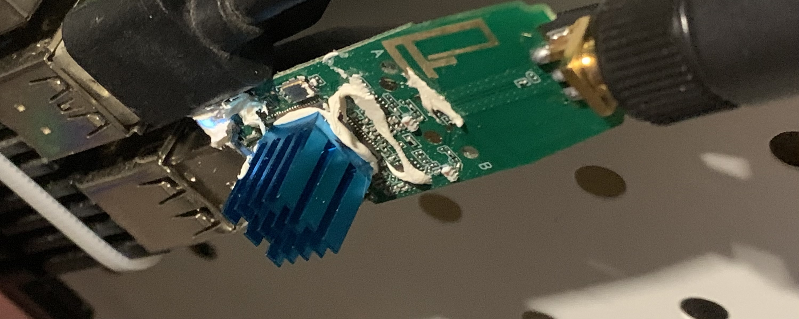

记录 RTL8821 Linux 无线网卡驱动的识别、编译、安装和调试过程。

<!--more-->

首先确定 USB VID
```sh
$ lsusb
Bus 001 Device 004: ID 0bda:8812 Realtek Semiconductor Corp. RTL8812AU 802.11a/b/g/n/ac 2T2R DB WLAN Adapter
root hub
```

我说使用的开源驱动：
```
https://github.com/aircrack-ng/rtl8812au
```
我的内核版本：
```
$ uname -a
Linux raspberrypi 6.1.21-v8+ #1642 SMP PREEMPT Mon Apr  3 17:24:16 BST 2023 aarch64 GNU/Linux
```
安装 Linux Kernel Headers
```sh
sudo apt install linux-headers-(uname -r)
```
如果是树莓派：
```sh
sudo apt install raspberrypi-kernel-headers
```


编译内核模块
```sh
$ git clone https://github.com/aircrack-ng/rtl8812au --depth 1
$ make -j8
```

如果是树莓派，需要修改 Makefile 指定平台架构：
```diff
ihexon@raspberrypi ~/rtl8812au (v5.6.4.2)> git diff
diff --git a/Makefile b/Makefile
index 947d319..31b9d5a 100755
--- a/Makefile
+++ b/Makefile
@@ -97,10 +97,10 @@ CONFIG_RTW_SDIO_PM_KEEP_POWER = y
 ###################### MP HW TX MODE FOR VHT #######################
 CONFIG_MP_VHT_HW_TX_MODE = n
 ###################### Platform Related #######################
-CONFIG_PLATFORM_I386_PC = y
+CONFIG_PLATFORM_I386_PC = n
 CONFIG_PLATFORM_ANDROID_ARM64 = n
 CONFIG_PLATFORM_ARM_RPI = n
-CONFIG_PLATFORM_ARM64_RPI = n
+CONFIG_PLATFORM_ARM64_RPI = y
 CONFIG_PLATFORM_ARM_NV_NANO = n
 CONFIG_PLATFORM_ANDROID_X86 = n
 CONFIG_PLATFORM_ANDROID_INTEL_X86 = n
```

加载驱动模块：
```sh
$ sudo insmod 88XXau.ko
```

查看 dmesg 信息，此时 Wireless interface 显示注册启用：
```sh
$ dmesg| grep 88XX
[   52.215905] 88XXau: loading out-of-tree module taints kernel.
[   52.381751] usb 1-1.3: 88XXau 54:c9:ff:02:c0:23 hw_info[d7]
[   52.388130] usbcore: registered new interface driver rtl88XXau
```

测个速看看：
```sh
$ iperf3  -c 192.168.31.254 -t 10
Connecting to host 192.168.31.254, port 5201
[  5] local 192.168.31.170 port 46672 connected to 192.168.31.254 port 5201
[ ID] Interval           Transfer     Bitrate         Retr  Cwnd
[  5]   0.00-1.00   sec  8.42 MBytes  70.6 Mbits/sec    0    462 KBytes
[  5]   1.00-2.00   sec  9.92 MBytes  83.2 Mbits/sec    0    905 KBytes
[  5]   2.00-3.00   sec  10.0 MBytes  83.9 Mbits/sec    0   1.17 MBytes
[  5]   3.00-4.00   sec  7.50 MBytes  62.9 Mbits/sec    0   1.31 MBytes
[  5]   4.00-5.00   sec  6.25 MBytes  52.4 Mbits/sec    0   1.31 MBytes
[  5]   5.00-6.00   sec  5.00 MBytes  41.9 Mbits/sec    0   1.39 MBytes
[  5]   6.00-7.00   sec  7.50 MBytes  62.9 Mbits/sec    0   1.46 MBytes
[  5]   7.00-8.00   sec  7.50 MBytes  62.9 Mbits/sec    0   1.46 MBytes
[  5]   8.00-9.00   sec  6.25 MBytes  52.4 Mbits/sec    0   1.55 MBytes
[  5]   9.00-10.00  sec  8.75 MBytes  73.4 Mbits/sec    0   1.71 MBytes
- - - - - - - - - - - - - - - - - - - - - - - - -
[ ID] Interval           Transfer     Bitrate         Retr
[  5]   0.00-10.00  sec  77.1 MBytes  64.7 Mbits/sec    0             sender
[  5]   0.00-10.08  sec  73.7 MBytes  61.3 Mbits/sec                  receiver

iperf Done.
```

## 散热问题

这张无线网卡承载了一个比较繁忙当对速度要求不高的局域网文件传输服务。但后期发现 RTL8821 有时候会断开连接，要么就是丢包率陡然上升，我以为是驱动稳定性的问题。

直到有一次摸了一下网卡，被烫的跳起来，这起码得有 80 多度了....最后拆开外壳加了散热片，至此变得非常稳定：）


