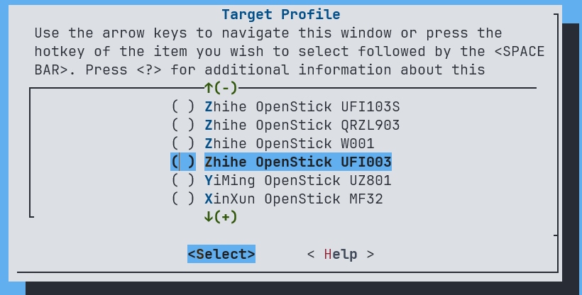
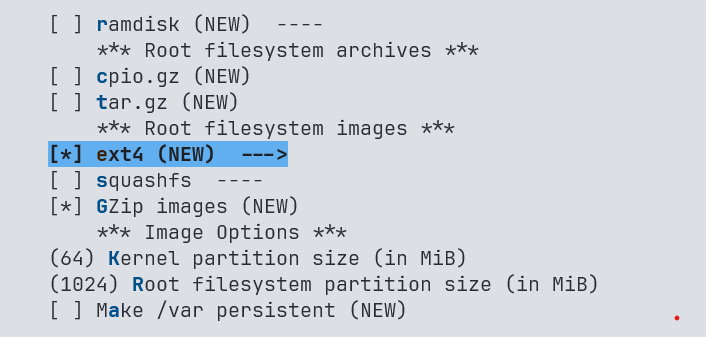
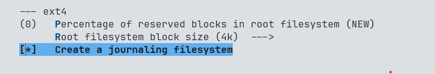
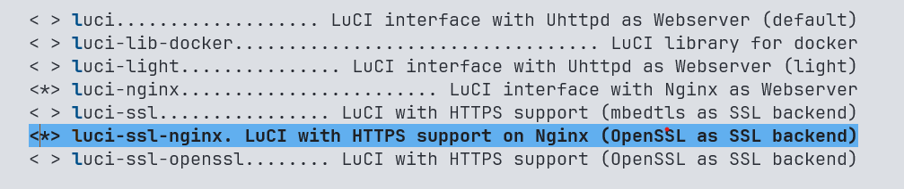
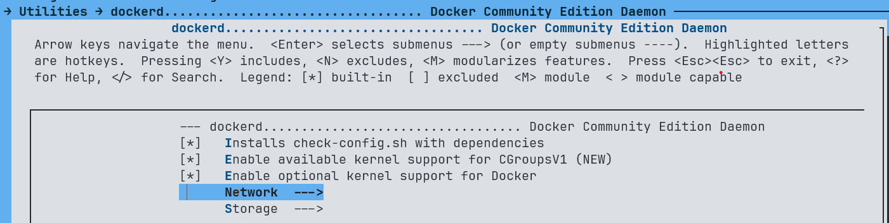
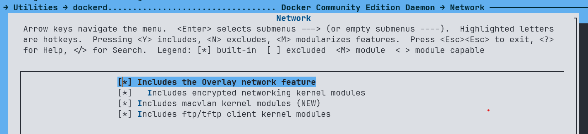
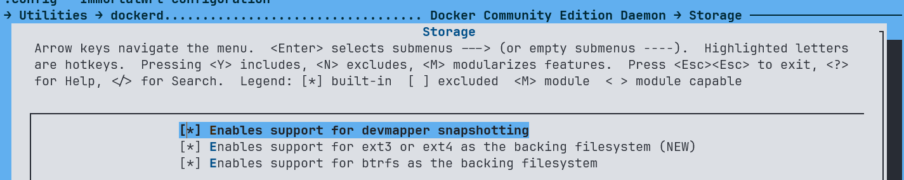
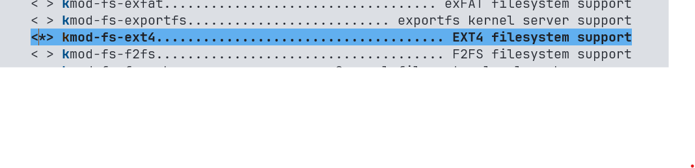
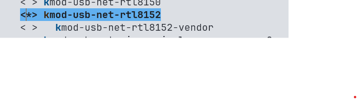
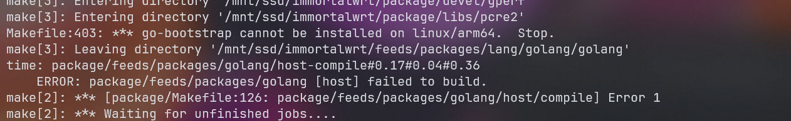

记录 MSM8916/UFI 设备上的 lk2nd、OpenWrt 启动、分区和调试过程。

<!--more-->

## MSM8916 研究记录

## lk1nd/lk2nd

- `lk2nd`: 
"secondary" bootloader intended for devices where existing firmware cannot be replaced easily (most smartphones and tablets). In this configuration, lk2nd does not replace the stock bootloader. Instead, it is packed into an Android boot image, which is then loaded by the stock bootloader just like the original Android image. The real operating system can be placed in the boot partition with 512 KiB offset or stored in a ext2 file system. It does not have to be Android or even Linux, any kind of kernel can be packed into an Android boot image. 

- `lk1st`:
primary bootloader intended for single-board computers (SBCs) and expert users. In this case, it is the "first" bootloader responsible for loading the main operating system.

所以 lk1nd 为 1 级引导，用于启动整个操作系统。而 lk2nd 不是必须的，lk2nd 提供给我们一个比较友好的 fastboot interface 来维护 emmc 内的各个分区。
## UFI003 OpenWrt Build Notes

Build Environment:
```bash
ihexon@ihexon-desktop /m/s/immortalwrt (master)> uname -a
Linux ihexon-desktop 5.10.160-rockchip #20 SMP Sun Nov 12 16:13:15 UTC 2023 aarch64 aarch64 aarch64 GNU/Linux


ihexon@ihexon-desktop /m/s/immortalwrt (master)> gcc -v;
Using built-in specs.
COLLECT_GCC=gcc
COLLECT_LTO_WRAPPER=/usr/lib/gcc/aarch64-linux-gnu/11/lto-wrapper
Target: aarch64-linux-gnu
Configured with: ../src/configure -v --with-pkgversion='Ubuntu 11.4.0-1ubuntu1~22.04' --with-bugurl=file:///usr/share/doc/gcc-11/README.Bugs --enable-languages=c,ada,c++,go,d,fortran,objc,obj-c++,m2 --prefix=/usr --with-gcc-major-version-only --program-suffix=-11 --program-prefix=aarch64-linux-gnu- --enable-shared --enable-linker-build-id --libexecdir=/usr/lib --without-included-gettext --enable-threads=posix --libdir=/usr/lib --enable-nls --enable-bootstrap --enable-clocale=gnu --enable-libstdcxx-debug --enable-libstdcxx-time=yes --with-default-libstdcxx-abi=new --enable-gnu-unique-object --disable-libquadmath --disable-libquadmath-support --enable-plugin --enable-default-pie --with-system-zlib --enable-libphobos-checking=release --with-target-system-zlib=auto --enable-objc-gc=auto --enable-multiarch --enable-fix-cortex-a53-843419 --disable-werror --enable-checking=release --build=aarch64-linux-gnu --host=aarch64-linux-gnu --target=aarch64-linux-gnu --with-build-config=bootstrap-lto-lean --enable-link-serialization=2
Thread model: posix
Supported LTO compression algorithms: zlib zstd

```
Git repo:
```bash
ihexon@ihexon-desktop /m/s/immortalwrt (master)> git remote -v
origin  https://github.com/lkiuyu/immortalwrt (fetch)
origin  https://github.com/lkiuyu/immortalwrt (push)
```
Thanks to `lkiuyu/immortalwrt`, all UFI kernel/packages/firmware patches are integrated into this branch, so we can easily build our own image for UFI stick `:)`

```sh
$ ./scripts/feeds update -a
$ ./scripts/feeds install -a -f
```

Before building OpenWrt, install the required packages and make sure you have stable network connectivity:
```bash
> sudo apt install u-boot-tools simg2img perl
> set -x http_proxy  http://IP:PORT # set http(s)_proxy
> set -x https_proxy http://IP:PORT 
```


## Make \.config

You need at least 50 GB of disk space.


```bash
> make defconfig
> make menuconfig
```

重要的配置会一一列举，其余的附加功能可以自己定制：

- Select Target system, 


For now I have `Zhihe OpenStick UFI003`, so select right profile to start build:



Adjust the Target Images:


We dont need squashfs cause we want the root can be modifies in the future. Make sure the image is big enough to store the rootfs, recommend `1024M` or bigger.

Most important, create an ext4 filesystem with a journal:



### LuCI Configure

Definitely we need LuCI interface, so select LuCI packages.
I use nginx with SSL as the LuCI web server:


UFI has a modem, so LuCI needs ModemManager.

`LuCI → 5. Protocols ──>`


### Docker






### Filesystem



### USB 网络




## Errors
go-bootstrap cannot be installed on arm64 system


In x86 system without any problem, but arm64 environment has this issue, simple to solve:
edit .config, set CONFIG_GOLANG_EXTERNAL_BOOTSTRAP_ROOT to your go installed path:
```
CONFIG_GOLANG_EXTERNAL_BOOTSTRAP_ROOT="/home/ihexon/go/"
```

Now run make again.

打开 USB ADB 调试，并关闭其他 USB 功能，如果同时开启 adbd 和 rndis 会导致 ADB 无法发现 UFI1003 设备，因为 Windows 似乎不支持 USB 多设备。 


```sh
ihexon@raspberrypi /t/rootfs> cat etc/config/gc
config gc 'config'
        option enabled '1'
        option adb '1'
        option rndis '0'
        option mass '0'
        option mass_path '/'
        option serial '0'
        option hid '0'
        option ecm '0'
        option acm '0'
        option printer '0'
        option midi '0'
```

## Debug

```
make -j23 V=sc  2>&1 |tee build.log | grep -i -E "^make.*(error|[12345]...Entering dir)"
```

所有的日志将被写入 build.log 中，以便定位错误。


## Refer
- https://wiki.postmarketos.org/wiki/Lk2nd/lk1st
- https://openwrt.org/docs/guide-developer/start
