记录 UFI001C/MSM8916 平台刷写 OpenWrt、配置网络、SSH、ZRAM 与救援流程。

<!--more-->

## OpenWrt4UFI Stick Notes

## Hardware & SerialConsole

- `MSM8916 Soc` 平台
- `4GB eMMC`
- `512MB DDR` 内存

相关 dts 树文件：

```
msm8916.dtsi
msm8916-ufi.dtsi
msm8916-thwc-ufi001c.dts
```

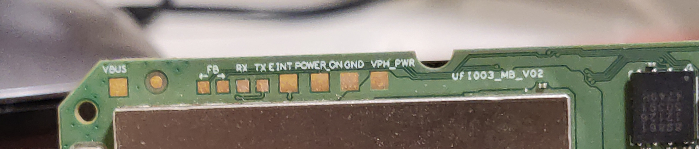

我的 UFI BCP 丝印为 `UFI003_MB_V02`，Serial Console 的触点也有提示，注意使用 `FT232 USB UART Board` 的时候需要连接 UFI 的 `GND` 触点，否则 Serial Console 无输出。

> 无论如何也不要连接 VCC 触点
### 写入系统镜像

下载 Android platform-tools：
https://developer.android.com/tools/releases/platform-tools

内核分区与文件系统镜像分别是：

> `immortalwrt-msm89xx-msm8916-openstick-ufi003-ext4-boot.img`：rootfs 分区
>`immortalwrt-msm89xx-msm8916-openstick-ufi003-ext4-boot.img`：内核所在的 Boot 分区


我的 UFI Wi-Fi Stick 的原厂 Firmware 就已经开启了 adbd，使用  `adb reboot bootloader` 直接就进到原厂 fastboot 了：

```sh
$ adb devices
* daemon not running; starting now at tcp:5037
* daemon started successfully
List of devices attached
0123456789      device
$ adb reboot bootloader 

$ fastboot devices
6597cd5e         fastboot
```

如果之前写入过镜像，那么只需要写入 boot 和 rootfs 分区。

```sh
$ fastboot flash boot immortalwrt-msm89xx-msm8916-openstick-ufi003-ext4-boot.img
$ fastboot flash rootfs immortalwrt-msm89xx-msm8916-openstick-ufi003-ext4-system.img
```

如果是从原厂 Android 镜像刷成 OpenWrt，那么需要更改分区表和写入 lk1nd 来引导 Linux 内核，最后写入 boot 和 rootfs 分区：

```sh
# 写入 lk2nd 
fastboot erase boot
fastboot flash boot lk2nd.img
fastboot reboot

# 使用 lk2nd 备份基带固件
fastboot oem dump fsc
fastboot get_staged fsc.bin
fastboot oem dump fsg 
fastboot get_staged fsg.bin
fastboot oem dump modemst1
fastboot get_staged modemst1.bin
fastboot oem dump modemst2 
fastboot get_staged modemst2.bin
fastboot erase lk2nd
fastboot erase boot
fastboot reboot bootloader

# 写入高通 Bootloader 启动链与备份的原厂基带固件，
# lk2nd & lk1nd 是开源实现，这样 Linux Kernel 就可以支持初始化 KVM 环境 
fastboot flash partition gpt_both0.bin
fastboot flash hyp hyp.mbn
fastboot flash rpm rpm.mbn
fastboot flash sbl1 sbl1.mbn
fastboot flash tz tz.mbn
fastboot flash fsc fsc.bin
fastboot flash fsg fsg.bin
fastboot flash modemst1 modemst1.bin
fastboot flash modemst2 modemst2.bin
fastboot flash aboot aboot.bin
fastboot flash cdt sbc_1.0_8016.bin
fastboot erase boot
fastboot erase rootfs
fastboot reboot

# 写入 rootfs 和 boot 分区
fastboot flash boot immortalwrt-msm89xx-msm8916-openstick-ufi003-ext4-boot.img
fastboot flash rootfs immortalwrt-msm89xx-msm8916-openstick-ufi003-ext4-system.img


fastboot reboot
```

> 请注意权限问题：如果Linux 的 udev 规则没有自动给当前用户添加 usb 设备读写权限，请使用 sudo 执行 adb 和 fastboot

在第一次启动后，OpenWrt会调整 rootfs 分区的结束扇区到 eMMC 的末尾，随后重启。

正常情况下：
- UFI 会作为一个 ADB 设备挂在主机 USB 端口上
- 可以搜索到新的 Wi-Fi 信号：

- 红灯闪烁

如果 UFI 设备变成了 9008/EDL 或者 9006 模式，说明某一步骤出错了：（，需要进入9008救援模式恢复原厂固件。


## 配置
### 扩展卡

UFI003_MB_V02 可以接上扩展卡，实现 供电+百兆有线网+双USB+SD卡功能：

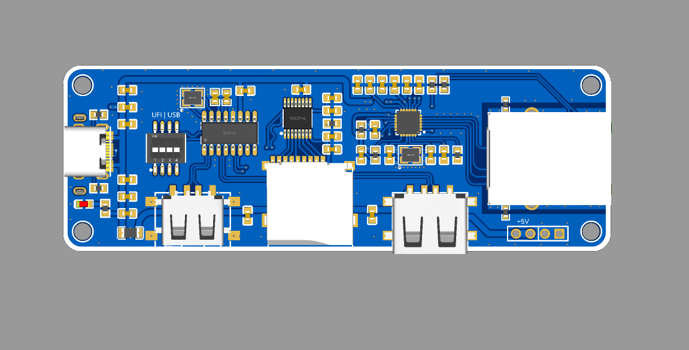

SSH 登录 OpenWrt 后 `ip addr` 可以看到 eth0 设备。

将 UFI 作为一个小型服务器，DHCP Client 模式，挂在路由器后面，这就需要调整 br-lan，取消 eth0 的桥接模式：

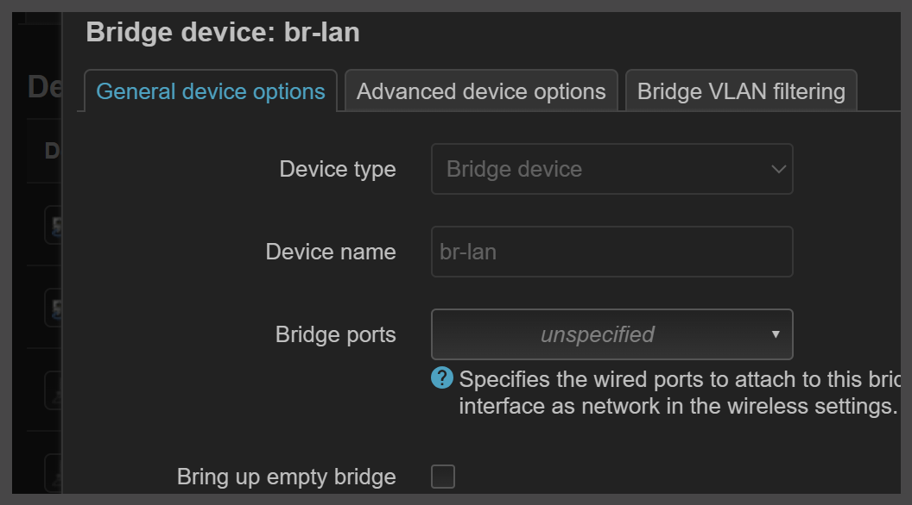

在 `cgi-bin/luci/admin/network/network` 页面内的 `Interfaces` 子页面内，添加一个 Interface，名为 WiredExtend，对应的物理设备为 eth0，Protocol 为 DHCP Client 模式：

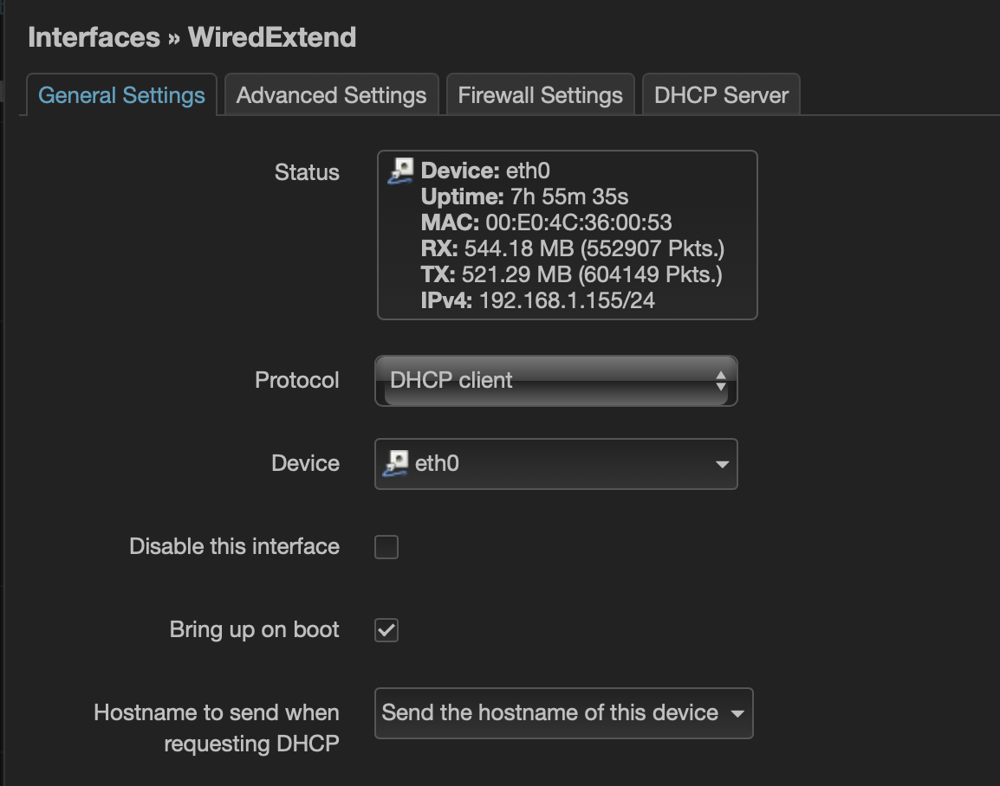

防火墙区域选择 WAN：
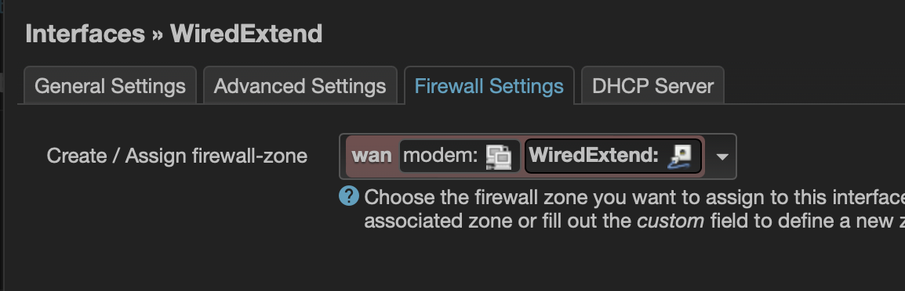

OpenWrt 默认的 br-lan 地址为 192.168.1.1，这可能会与上级路由器冲突，需要修改 br-lan 为 其他地址如 192.168.4.1，加入 UFI Wi-Fi 信号的设备 IP 地址将变为 192.168.4.1/24：

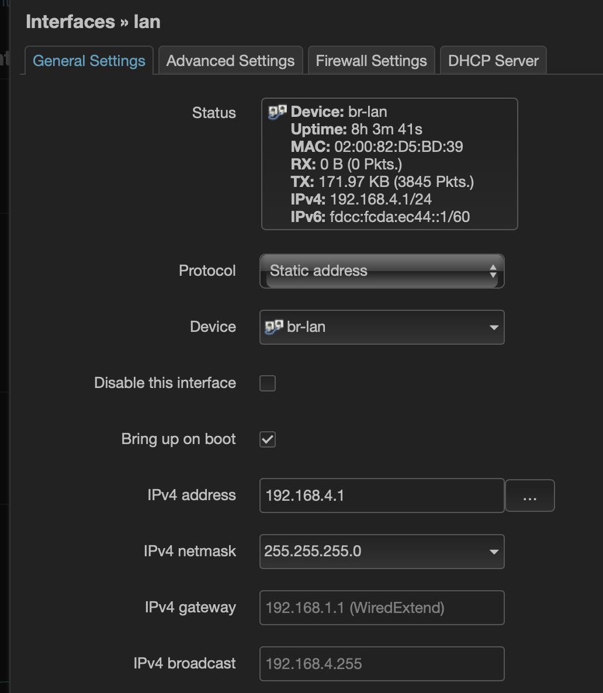


### SSH 配置

默认情况下，只有加入 OpenWrt Wi-Fi 的设备能 SSH 上 OpenWrt，如果想从上级网络访问 OpenWrt，需要更改监听的 Interface
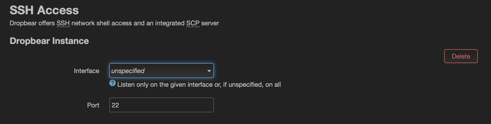

防火墙允许入栈 22 端口：


### ZRAM
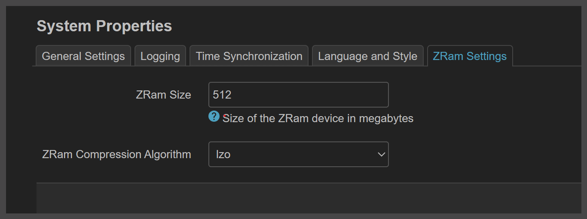

### NTP 自动时间同步

通过 time.apple.com 来同步时间，我这里填入的是 IP 而不是域名：
```
Name:    time.apple.com
Addresses:  17.253.2.125
          17.253.2.253
          17.253.20.253
```
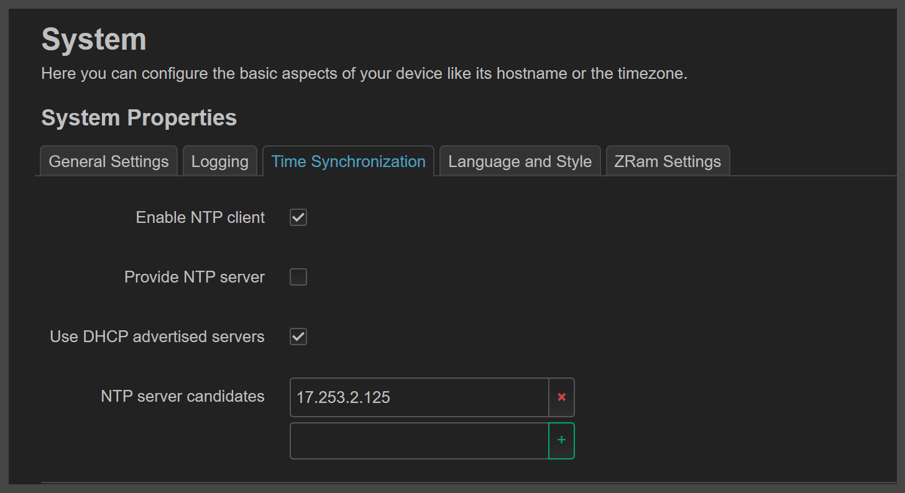

### Local Startup 脚本
> 已经不用设置了，这个脚本写进自启动脚本里(rc.local)了

使用脚本让 USB 在 Host/Gadgets 模式之间自动切换：

```sh
sleep 2
grep 0 /sys/kernel/debug/usb/ci_hdrc.0/device | grep speed
if [ $? -eq 0 ]
then
echo host > /sys/kernel/debug/usb/ci_hdrc.0/role
fi
```

实际上 UFI003_MB_V02 支持USB 模式自动切换，但需要修改内核 dts 树：

>`https://lists.sr.ht/~postmarketos/upstreaming/%3CTYZPR04MB632102315884225B7343533B96729%40TYZPR04MB6321.apcprd04.prod.outlook.com%3E`

由于我构建的 ImmortalWrt 还未引入整个 patch，所以还是得靠这个不优雅的startup 脚本实现自动切换。


### LED 灯状态

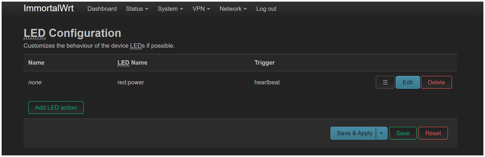

更多的 LED 灯控制模式可以在 命令行中调试，如：

```sh
root@ImmortalWrt:/sys/class/leds/red:power# pwd
/sys/class/leds/red:power
root@ImmortalWrt:/sys/class/leds/red:power# cat trigger
root@ImmortalWrt:/sys/class/leds/red:power# echo phy0tx > trigger
```

> BUGs ：操作 mmc0:: 会导致Kernel crash，可能会导致 emmc 损坏。

我一般设置red LED 旨在 kernel panic 的时候给我亮起，这时候我就知道 Kernel 崩溃了，其他时候LED 灯全部关闭。

### 如何让高通基带正常运行

实际上高通基带是已经驱动了的，可以使用 `mmcli -m 0` 查看基带运行状态：
```
  System   |            device: qcom-soc
           |           physdev: /sys/devices/platform/soc@0/4080000.remoteproc
           |           drivers: qcom-q6v5-mss, bam-dmux
           |            plugin: qcom-soc
           |      primary port: wwan0qmi0
           |             ports: wwan0 (net), wwan0at0 (at), wwan0qmi0 (qmi), wwan1 (net),
           |                    wwan2 (net), wwan3 (net), wwan4 (net), wwan5 (net), wwan6 (net),
           |                    wwan7 (net)
  -----------------------------
  Status   |             state: failed
           |     failed reason: sim-missing
```

但是一插卡 modemmanager 就崩溃，但问题不大，`/etc/init.d/modemmanager stop & /etc/init.d/modemmanager start` 就正常了。 


## 日常维护
### SSH
### ADB 端口转发
通过 adb 转发端口，如通过 adb 转发 ufi:443 到本机 `127.0.0.1:8443` 配置 openwrt
```
$ adb  forward tcp:8443 tcp:443
$ firefox https://127.0.0.1:8443
```
转发 ufi:22 端口到 本机 127.0.0.1:8022
```
$ adb  forward tcp:2222 tcp:2222
$ ssh -p2222 root@127.0.0.1
```
通过 adb 转发的方式访问 UFI SSH 需要将 SSH Access 页面的 Interface 改为 unspecified 


### GC
默认是 `adb`，配置文件在 `/etc/config` 内，修改后 ``/etc/init.d/gc restart`


### 9008 模式救援模式

高通 msm8916 平台的 EDL 模式可以做许多 Low Level 的操作，理论上 UFI 设备是无法被彻底写坏的，大部分误操作都可以通过进入 EDL 模式使用 Miko Service Tool 还原 UFI 设备。 

Please refer to: https://en.wikipedia.org/wiki/Qualcomm_EDL_mode

- 按住 BPC 上的按钮不放，插入 USB 接口后 UFI 上电进入 EDL 模式
- `adb reboot bootloader` 和 `fastboot oem reboot-edl` 进入 EDL 模式


通过 Miko 内自带 EDL 端口驱动，可以很方便的安装：
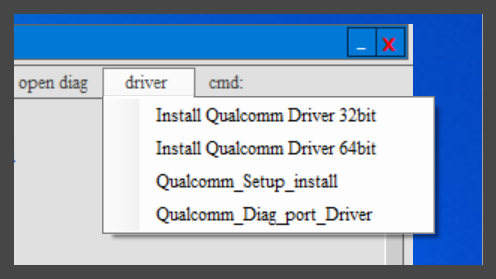

### 清空 eMMC 分区表
从 eMMC 0 扇区开始进行破坏性写入一个 100m 大小的空白 blank.img 到 eMMC 中，旧的分区表就无了：
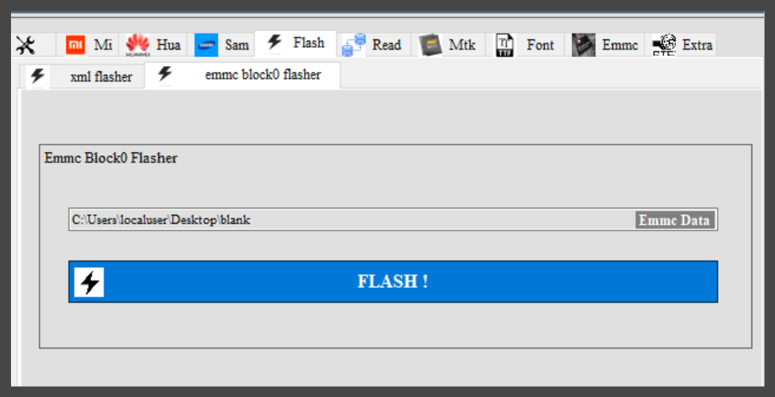

> 注意将 UFI 设备连接到 VMware 虚拟机内而不是 Host 机，你可能需要反复重连确保 Miko 正确找到 EDL 设备。


> 注意网上流传的 Miko Service Tool Pro 基本上是 “Cracked Software”，主程序由 `Loader.exe` 启动，安全性未知。
> 像我一样有洁癖的人士建议在虚拟机内操作。

> Notice：You can using `bkerler/edl` which is OpenSource `Qualcomm Sahara / Firehose Attack Client / Diag Tools`


### 恢复原厂固件

解开原厂固件 `UFI003_MB_V02_EDL.7z`，在 xml flasher 功能区域中选择 rawprogram0.xml 文件就可以还原 UFI 的原厂系统：
> sha1sum of UFI003_MB_V02_EDL : 
> 86226dce4f2782dfaa91bc0002317e4cb2cb7693  UFI003_MB_V02_EDL.7z

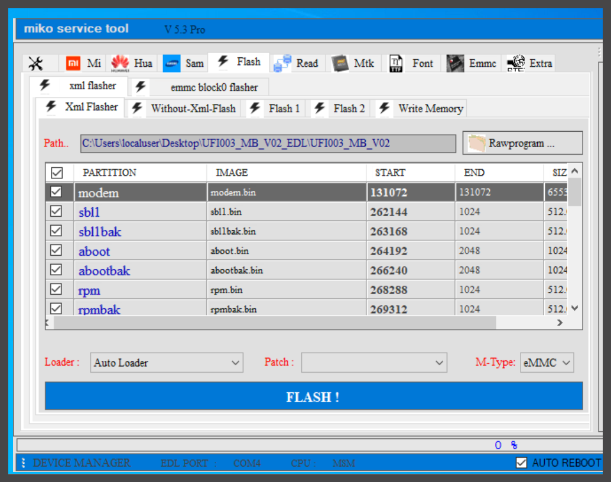

但是这里我们只需要将 UFI 设备重置到 fastboot 模式就可以，并不需要写入整个原厂固件，另外写入原厂固件后 ADB 能不呢顺利开启也是一个问题。这里选择跳过 system 和 userdata 两个分区：

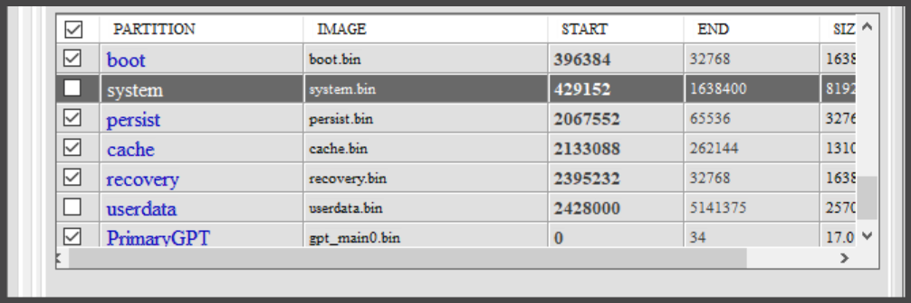

UFI上电后自然会进入原厂 fastboot 模式：

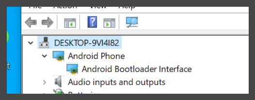

也有可能是这种设备


### Windows 找不到 ADB 设备的问题

某些时候存在 Windows 上使用 fastboot 设备找不到的问题，设备识别为 `HandsomeMod Devices`：
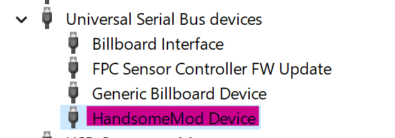

本质上是 Fastboot 驱动无法匹配 USB VID 造成的，因为USB Gadget 模拟的 USB VID 并没有在 fastboot 驱动支持列表（*.ini）里，遇到这种情况需要手动选择驱动类型：

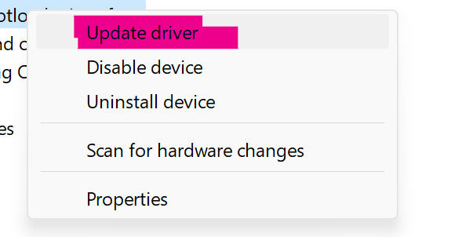

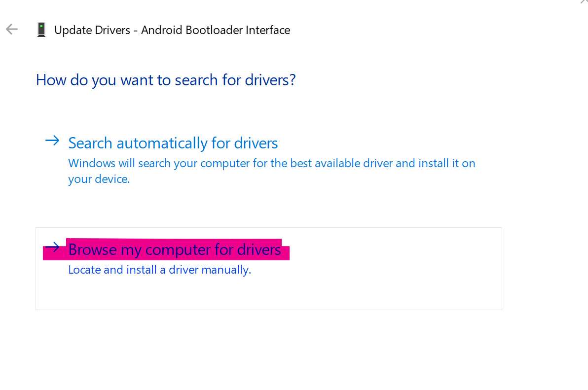
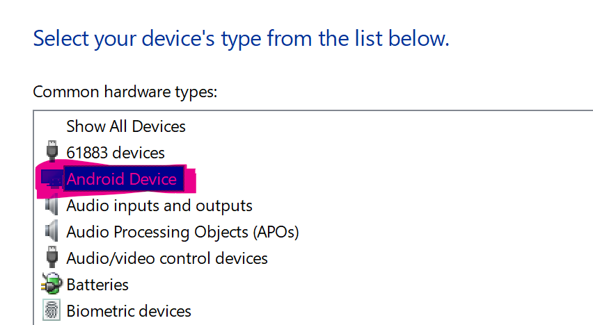
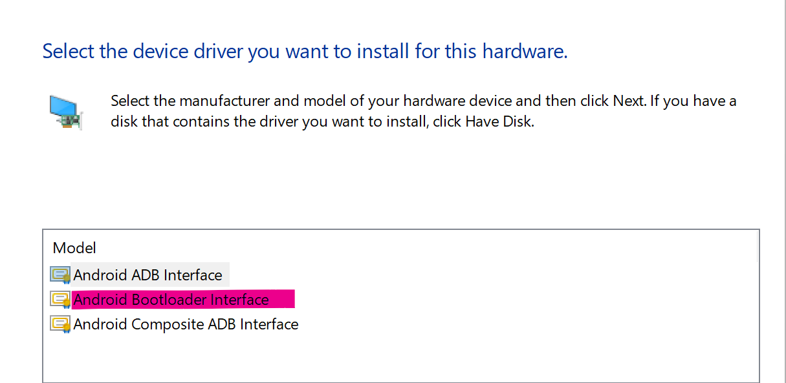

这个时候Win11 应该就可以看到 fastboot 设备，再次输入 fastboot devices 可以看到设备上线。

### 网口兼容性

有些时候出现网口灯只亮一边（正常情况下是绿色的灯闪烁），从家用路由器中引出的网线大部分正常，**但从交换机出来的网线有时候则不可以**，似乎是速率协商或者扩展板硬件设计导致的问题。


## 高级玩法

### KVM
内核已经开启了 KVM，通过 dmesg 验证：
```sh
# dmesg | grep kvm
[    0.463218] kvm [1]: IPA Size Limit: 40 bits
[    0.471721] kvm [1]: vgic interrupt IRQ9
[    0.475241] kvm [1]: Hyp mode initialized successfully
```

理论上吧 aarch64 架构的 Qemu ELF 可执行文件直接放到 OpenWrt 中跑就可以，不过我没尝试。有空的友友们可以试试看。

### 修改 rootfs 和 boot 镜像

> 你可以修改 rootfs 和 boot 镜像定制自己的 OpenWrt 系统，配合 UFI 上电过程中的 Serial Console Logs 定位具体的问题。

使用 simg2img 将 Android sparse image 转换为 正常的 ext4 img 镜像：
```sh
$ sudo apt install simg2img img2simg
$ simg2img \
    immortalwrt-msm89xx-msm8916-openstick-ufi003-ext4-system.img \
    immortalwrt-msm89xx-msm8916-openstick-ufi003-ext4-system.img.ext4
```
挂载镜像到 `/tmp/rootfs/` 下：
```sh
sudo mount \
    immortalwrt-msm89xx-msm8916-openstick-ufi003-ext4-system.img.ext4  \
    /tmp/rootfs/
```


修改完成后记得执行 sync 避免 Linux 上的IO缓存造成的问题，使用 img2simg 工具从 ext4 img 转换为 Android sparse image：
```
img2simg \
    immortalwrt-msm89xx-msm8916-openstick-ufi003-ext4-system.img.ext4 \
    immortalwrt-msm89xx-msm8916-openstick-ufi003-ext4-system.img
```


## Build Your Firmware
Assuming you are an experienced developer

Build your firmware : 
- https://github.com/lkiuyu/immortalwrt
- https://github.com/lkiuyu/immortalwrt-ufi-build-action
- https://forum.openwrt.org/t/uf896-qualcomm-msm8916-lte-router-384mib-ram-2-4gib-flash-android-openwrt/131712/122
-
